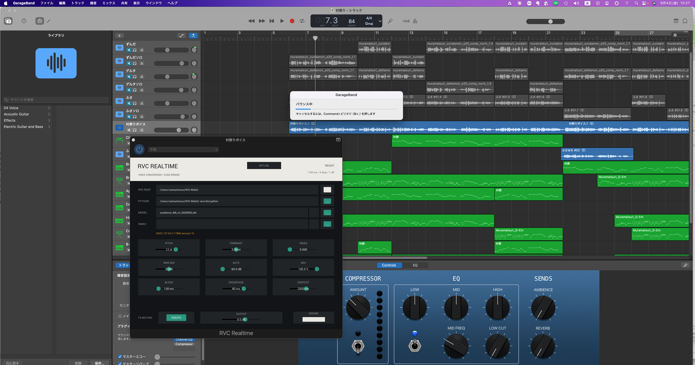

# AIにランナーを3回殺させてもGarageBandを落とさないRVC AUv2を作った

Windows向けだったRVCを、Intel Macの学習・推論からBonjour、GarageBandの標準offline bounceまで登攀させた記録



> 画像ファイル: `assets/fusamofu-img/AUv2inside.png`

🎵 実演動画：[ずんだもん・デルタもん・生声で歌う「村祭」](https://youtube.com/shorts/Y91K-4o8xz0)

---

## 出航するとき、本家にあったのはWindowsの海図だった

RVC、Retrieval-based Voice Conversionは、声の質感を別のモデルへ変換する技術だ。世界中で歌声変換、配信、実験音楽、キャラクターボイスの研究に使われている。

だが、私が船を出そうとしたとき、本家repositoryのRealtime実装はWindowsのWebUIとVST2/VST3を主な海域としていた。READMEに並ぶのもWindowsの画面だ。macOS、しかもApple SiliconではなくIntel Macで、学習からGarageBandのAudio Unitまで通す航路はなかった。

ここで「新しいMacを買え」という正しい助言は、なんの役にも立たない。マシンが古いなら、古いマシンがどこまで登れるかを試すのが実験だ。私はHackintoshを12年運用してきた古参ハカーである。Appleの行儀の良さと悪さ、わざと閉じている所と、OSに任せればむしろ楽に通る所は、ひと通り火傷している。

それでも、この登攀は想像以上に面倒だった。理由はRVCの計算が重いからだけではない。WebUIのワーカー文化と、Audio Unitの厳しい実行境界と、DAWの時間制約が正面衝突するからだ。

## 最初の勘違い：AUに全部抱え込ませればいいわけではない

初期案は、AU側からPythonやRVC workerを直接起動し、モデルのパスを与え、共有メモリで音声を往復させるものだった。Windowsの単体VSTとしては自然な考え方に見える。プラグインが必要なものを全部持ち、必要なときにworkerを生やし、音声コールバックと結ぶ。表面的には一枚で閉じていて、それっぽい。

だがAppleのAudio Unitでそれをやると、プラグインは自分だけの小国家ではない。GarageBandというhostの中に同居し、hostの実行環境、sandbox、thread、終了手順に従う。音声threadは期限付きの現場であり、Pythonの起動、PyTorchのロード、network待ち、filesystem探索などを積む場所ではない。コールバックの期限に遅れたら、音楽は理由を読んでくれない。ただプチッと切れる。

そもそもRVCはWebUIの背後で働くワーカーとして育っている。ならば、WebUIがもともと持っているエンジン、モデル、Python環境をそのまま活かし、AUは音声のheadになるべきだ。死んでいたらWebUIが起こし、生きていたらそれを使う。AUは選んだランタイムへ音を流す。この役割分担へ戻したことが、後のすべてを救った。

## その前に、Intel Macで本当に学習できるのか

AUの画面だけ作って、中身は別のWindowsマシンに任せるなら簡単だったかもしれない。だが今回の目標は、「Macでウィンドウが開いた」ではない。Intel Macで学習が走り、モデルができ、実音声を変換し、最後にGarageBandの中で歌うことだ。

学習したのは40kHz、F0あり、v2の歌唱モデル。デルタもん側では、65ファイル、約805秒の入力から233 clipsを生成した。無音1本は「成功っぽく通過」させず、非静音区間がないと明示してskipした。F0抽出はRMVPEで233/233成功、HuBERT特徴量も233/233成功。mute用の2行を加えたfilelistは235行になった。

ここまで来るのに、無音clipで`UnboundLocalError`、GPUがないのにDDPがTCPStoreをbindしようとして`Operation not permitted`、DataLoader workerが`torch_shm_manager`で止まる、script直接起動でmoduleの解決が壊れる、といった小さな地雷が並んだ。GPUマシンから見れば枝葉の例外でも、Intel CPUの陸路ではそれが本道だ。

そこでCPUはsingle process、DataLoader workerは0、scriptは`python -m`のmodule entrypointへ統一した。失敗は握りつぶさず、無音はskip、成果物は実在するintersectionから再構成した。

CPU学習は遅い。1 epoch約25分。20 epochが完了したのは翌朝7時19分。それでもgenerator/discriminatorのcheckpointはでき、推論用weightを抽出できた。「村祭」の音声をCPUで変換し、人間が聞いて、声質、古語訛り、ビブラート、しゃくりに重大なNGがないことを確認した。ずんだもん側と合わせ、少なくとも手元には実際に動く2つのモデルができた。

ここは大事な境界なので書いておく。学習は「未確認」ではない。実際に2モデルで完走した。ただし、低火力のIntel Macでclean checkoutするたびに数十時間の再学習を何度も煮直す品質保証はしていない。それは事実の強度を下げる話ではなく、実機資源の境界だ。

モデル、学習音声、index、中間成果物はrepositoryに入れていない。これらはキャラクターや音声資源の著作権・利用条件と絡む。動画はコードが動いた証拠であって、モデルの配布ではない。

## GarageBandに挿さった。だが、まだ中身は空だった

次の関門はiPlug2でmacOS向けAPPとAUv2をbuildすることだった。CMake構成、bundleのInfo.plist、resource、Audio Unitのcomponent subtypeとmanufacturer、ローカル署名、配置先を整え、`auval -v aufx Rvcr Rvcp`を通した。

そしてGarageBandを起動し、実際の「村祭」プロジェクトのボーカルトラックに`RVC Realtime`を挿した。CompressorやChannel EQと並んで、自作のAudio Unitが現れた。GUIは描画され、GarageBandも落ちない。最初の登頂写真だ。

ただし、その時点の画面には、「macOS worker not implemented」と表示されていた。プラグインの皮は挿さったが、RVCエンジンと音声を往復する神経がない。「画面が出た」と「音が変わった」を同じ成功にしないことは、この開発で最後まで守った。

## Appleの境界に焼かれるその1：`shm_open`は通らない

実IPCを繋いでENGINEをONにすると、GarageBand上で`IPC initialization failed (shm_open errno 1)`が出た。`errno 1`は`EPERM`。素のCLIテストでは成功していたPOSIX名前付き共有メモリの作成が、GarageBandに挿さったAUからは拒否された。

これは「Macだから何もできない」という話ではない。境界の選び方が悪い。AUはGarageBandのプロセス内でhostされる。素のTerminalで起動したプロセスと同じ穴が開いていると思う方が間違っている。

解決は、`shm_open`の名前空間と正面衝突することではなかった。`$TMPDIR`配下の通常ファイルを`open`し、`ftruncate`し、`mmap(MAP_SHARED)`で共有する。Appleが用意したsandboxの通り道に合わせて、IPCの形を変えた。

このとき、OSの検疫やホワイト登録を無視して自前の「安全性」を作るのではなく、どの操作がホスト内で許され、どの責務を外のランタイムへ出すべきかを考えることになった。後にOSのセキュリティ確認が正式に発火し、人間が許可して通るところまで確認できた。「Appleの境界を信じる」という仮説に対する、否定検証の否定検証でもあった。

## Appleの境界に焼かれるその2：OpenMPは3回目の推論で落ちた

`shm_open`を越えた後、workerは別の形で死んだ。`libiomp5.dylib`の`__kmp_abort_process`、SIGABRT。最初はOpenMPの重複ロードだと疑ったが、`KMP_DUPLICATE_LIB_OK=TRUE`だけでは治らない。

そこでログを回数として読んだ。RVCの推論ログは最初の3回に必ず出るようになっていた。残っていたのは2回分だけ。つまり、1回目のprewarmは通り、2回目の実ブロックも通り、3回目の推論中に落ちている。「起動できない」ではなく、「繰り返し中にthread poolが育つと死ぬ」という性格が見えた。

仮説は、OpenMPが遅延的に追加threadを作ろうとし、GarageBand由来の実行境界で`pthread_create`が失敗し、致命的abortへ入るというもの。対応は`OMP_NUM_THREADS=1`。安定性と引き換えに、CPU推論は約550msから約1097msへ遅くなった。

普通ならここで「遅くなったから失敗」と言いたくなる。だが落ちる高速化は機能ではない。まず死なない経路を作り、速度は別の戦場で取り返せばいい。

## その3：MIDIを1本も使わないのにCoreMIDIで止まる

iPlug2のstandalone APPでは、MIDI inputもoutputも無効な構成でもCoreMIDI初期化の経路が走っていた。RVCはこのAPPでMIDIを使わない。使わない装備の点呼で出航が止まるのはバカらしい。

修正は小さい。MIDI input/outputがどちらも無効なAPPでは、CoreMIDI初期化とnull MIDI device選択をskipする。1ファイル、17追加・1削除の差分だ。これはRVCの都合でiPlug2の巨体を抱え込むより、iPlug2 forkに切り分けて本家へ返せるべき修正である。RVC本体とiPlug2の派生・記名・ライセンスの境界を分ける理由でもある。

## 結局、エンジンはWebUIが持ち、AUは薄いheadになった

沼を抜けた最終構成は、プラグインが何でも抱える巨大な単体ではない。

```text
GarageBand / AUv2
    ↓  軽量なC++ audio head
localhost control / audio gateway
    ↓
WebUIが所有するruntime supervisor
    ↓
RVC engine / Python / PyTorch / model
```

WebUIはランナーの起動、health check、回数を制限したrestart、モデルcatalog、Bonjour探索、接続先選択を持つ。制御serviceと死活管理は一つに集める。一方、realtime audio portは制御経路から分ける。

AUはサンプルをring bufferへ流し、準備された出力を受け取る。audio callback内にHTTP、Bonjour browse、filesystem探索、Python起動、モデルload、重いallocatorは入れない。準備が間に合わなければ、host全体を待たせるのではなく、そのblockをdropする。

この分離により、AUが落ちればGarageBandまで巻き込む構造から、ランナーが死んでもDAWは生き残る構造へ変わった。この違いは、後の障害注入試験ではっきり現れた。

## 「ベイク」と言ったせいで、存在しない独自仕様が生えた

開発中、私は「重い処理なら事前にベイクし、待った後はラグなしで再生したい」と伝えた。Blender的なAPI語彙である。その言葉を受けた実装側は、AUの中に独自のBAKE機能とcacheの概念を生やした。

しかし音楽業界には、そのための道具がある。DAWのoffline render、GarageBandでいうバウンスだ。ホストはプラグインに「realtimeではない」と通知し、プラグインはリアルタイムのdeadlineを越えても処理完了を待てる。

仕様の読み替えが生んだのは、AIの理解力だけのせいではない。私の言葉のFold Mapが甘かった。異なるフレームワーク間で、目的は同じでも標準の名前が違うとき、名称の空白から独自仕様が生える。これはAI開発でかなり一般化できる事故だ。

そこで独自BAKEは凍結し、Audio Unitの標準offline renderに置き換えた。hostが`kAudioUnitProperty_OfflineRender`を通知したときだけ、AUはRSVCの推論完了を待つ。GarageBandがpropertyを出さなければそこで停止する、という明確なHuman Gateを置いた。

GarageBandは出した。バウンス中、AUの表示は`OFFLINE`に変わり、普通のエフェクトよりずっとゆっくり進んだ。Intel CPUが一ブロックずつ推論しているのが、進捗バーの速度でわかる。

最初は単一トラックのsolo bounce。聞いて合格。次に設定を初期化し、伴奏付きmixをバウンス。これも合格。リアルタイム再生ではプチプチするのに、書き出したファイルはぬるぬると変換されている。ここで、低火力Intel Macに対する勝ち筋が定まった。

## リアルタイムの敗北を、製品全体の敗北にしない

実測すると、Intel CPUの1ブロック推論は約1.2〜1.3秒。リアルタイム音声のdeadlineより明らかに遅い。画面には500回以上のdropが表示され、耳にはプチプチと聞こえる。これは気合いで治す不具合ではない。現在のハードウェアとエンジンの計算量の関係である。

だから「Realtime」というラベルに全てを従わせるのをやめた。歌のレコーディングや制作では、常にリアルタイムで完成音を出す必要はない。操作中は原音や簡易monitorで構成を決め、最後のbounceで時間をかければいい。重いsynthやノイズ除去、線形位相EQでも見慣れた考え方だ。

この結果、「Intel MacでRVCがリアルタイム動作した」とは書かない。リアルタイムは音が出るが、dropoutが多く実用不合格。一方、GarageBand標準offline bounceは、単トラックと伴奏付きmixの両方で、変換効果があり、書き出し後の聴感でプチプチがないことを確認した。

なお、画面のdrop値はrealtime再生からの累積であり、offline block自体が同じ回数dropした証拠ではない。数字の表示と、書き出し音のHuman listeningは分けて判定した。

## Bonjourで、WebUIを「ローカルの後ろ」から「制作LANのランタイム」へ広げる

ランタイムをWebUI側に出したら、次に見えるのはnetworkだ。Macが一台でも、localhostの直結経路と、Bonjourで広告・探索・resolveした経路は切り替えられる。将来、軽量MacのGarageBandから、同じ制作LANにいる高火力マシンのRVCを拾える。AppleのJam Session的な手触りで、声変換の計算を外へ出せる。

ここでapplication独自のCIDRルールや、中途半端な「安全なsegment」判定は追加しなかった。BonjourはmacOSの`dns-sd` / mDNSResponderが見せる`.local`のサービスを広告・探索・解決する。どこまでパケットが届くか、VLANやmDNS reflectorをどう組むかはOSとnetworkの責務だ。このツールはSaaSのtenant分離を目指すものではなく、信頼した制作LANの道具である。

単一Macでの試験では、WebUIは`_rvc-realtime._tcp.local`として自分を広告し、自分で発見し、LocalhostとBonjour selfの2候補を返した。AUの`RUNTIME / SCAN / SELECT`からBonjour selfを選び、既存sessionを切断し、gateway越しに新しいsessionを張り直し、RVC推論まで通した。

リアルタイムでは約1297ms、530 dropと表示され、プチプチした。そのままoffline bounceへ入ると`OFFLINE`へ切り替わり、書き出しは完了。聞いた結果は、声質変換あり、プチプチなし、ぬるぬる。つまりBonjour経路の変更とoffline renderを、一つの音声経路として貫通できた。

ただし、これは別Macまで到達した証拠ではない。現在の実機は1台。自己広告、自己発見、経路切替、handshake、実推論までは合格した。Wi-Fi断、LAN RTT、2台間の実音、Windows Bonjour相互運用は、実機や外部contributorが現れたときに再開する凍結項目である。

## モデル名はパスではない：WebUIとAUが同じカタログを見る

Bonjourでremote runtimeへ繋ぐなら、AUがモデルのファイルパスを持つのはおかしい。クライアントMacの`/Users/.../model.pth`と、ランタイム側のパスは同じではない。そこでモデル実体とindexのパスはruntimeが所有し、AUへは安定したopaque model IDと表示名だけを出すことにした。

WebUIで選んだモデルはruntimeの既定値になる。AUが明示的に別モデルを選ぶと、そのAU sessionだけはWebUI既定よりAUの指定を優先する。WebUIに追従したければ`active`へ戻す。一つのruntimeへ複数クライアントが殺到したときの公平性や資源予約までは、今回のローカル制作ツールの保証範囲に入れていない。

ここでも地雷は出た。ずんだもんを選んでGarageBandの設定slotに保存し、復元すると、MODEL欄が人間向けの名前ではなく`rvc-d5d27b9ef69f373b`のようなID表示になった。変換そのものは正しい。保存すべきIDと、見せるべき表示名を同じ場所で扱い、復元後の名前解決をしていなかった。

ここで保存値を表示名へ戻すと、モデルrenameやremote runtimeで壊れる。だからopaque IDは保持し、`UnserializeState`と`OnUIOpen`は更新要求だけをatomicに立て、UI idle threadがcontrollerのカタログからIDを表示名へ解決するようにした。state復元処理とaudio callbackにnetwork I/Oは入れない。

修正後、設定slotの保存・復元、表示名の再解決、ずんだもんの変換音復帰までHuman Gateに合格した。「音が変わった」だけでなく、制作中に保存し、開き直し、人間がわかる名前で戻る所まで通した。

## バグが偶然死ぬのを待たず、再生中にこちらから殺す

私はエラーハンドルを、薄く広くバグを数える作業だとは思っていない。バグの総量はどんなソフトウェアにもある。重要なのは、当たると制作中の仕事そのものを壊す地雷を、狙って潰すことだ。

だから「3回テストした」ではなく、live-host fault-injectionをやった。私がGarageBandでプロジェクトを再生し、RVC Realtimeが音を処理しているその最中に、Codexがバックエンドのruntime processへシグナルを投げる。偶発的に死ぬのを待つのではなく、PID、PPID、listener、所有関係を確認し、対象だけを殺す。

ランナーを止めるとAUは一時的に変換出力を失う。だがGarageBandは落ちない。WebUIのsupervisorがランナーの死亡を検出し、bounded restartで再生成し、gatewayの先を戻す。AUは再接続し、READYへ復帰する。これを3回、再生中に行った。ホストは生き残った。

逆方向の障害注入もした。WebUI本体にSIGTERMを入れる。修正前はWebUIだけが死に、ランナーとBonjourの`dns-sd`子プロセスがPPID 1の孤児として残り、portを握り続けた。修正後はsignal handlerで重いcleanupをせず、SIGTERMを既存の終了経路へ渡し、外側の`finally`が所有childを回収する。WebUI、runner、advertiser、browser、listenerがすべて消えた。

オーディオプラグインの安定性は、「普通に再生できました」だけでは足りない。背後のAI workerが死んだとき、DAWとその中のプロジェクトを道連れにしないこと。その上で、死んだworkerを戻すこと。ここは、一番当たりたくない地雷だった。

## テストは「通った」ではなく、どの層が通ったかを分けた

開発中、何度も成功の境界を書き分けた。buildの成功はDAWでの成功ではない。`auval`の成功は、実モデルの声質変換成功ではない。CLIで非無音が返ったことは、GarageBandがsandbox内で同じように動く証拠ではない。バウンスファイルが生成されたことは、声が正しく変わった証拠ではない。最後は人間が聞く。

現在、空のdirectoryから提出用分岐を`git clone --recursive`し、submoduleの固定revisionを取得するところから再現確認できる。モデルの不要なPython回帰試験は43/43合格。Release APP/AU build合格。APP/AUの`codesign --verify --deep --strict`合格。clean buildのcomponentを一時配置した`auval -v aufx Rvcr Rvcp`は`AU VALIDATION SUCCEEDED`。検証後はそれまでGarageBandで使っていたcomponentへ復元した。

実機Human Gateでは、次を確認した。

- GarageBandがAUv2を認識し、GUIを表示する
- 実モデルで声質が変わる
- pitch `-12 st`でオクターブ下の歌声になる
- WebUI既定モデルとAU明示モデルを切り替えられる
- GarageBandの設定slotを保存・復元し、表示名と変換が戻る
- LocalhostとBonjour selfを切り替え、sessionを張り直す
- ランナー先行障害でGarageBandが生存し、ランナーが再生成される
- WebUI終了時に所有childとlistenerが回収される
- 単trackと伴奏付きmixの標準offline bounceが完了し、聞いて変換効果がありプチプチがない

それでも、未確認は残る。Windows実機回帰、Apple Silicon、Logic Pro、別Mac間Bonjour、Wi-Fi断、複数clientの排他・公平性・資源予約は未試験。これらを「おそらく大丈夫」で埋めない。現在は機材とcontributor待ちであり、実機が現れたときに開く凍結項目だ。

## 本家への海図は作った。しかし、港のPull Requestは閉じていた

forkの`main`には、開発中の実験票、画像、自動開発の運用文書、ローカル記録がある。これをそのまま本家へ投げるのは違う。そこで本家`main`を起点に、汎用source、tests、最小docsだけを抽出した提出用分岐`upstream/macos-au-webui-runtime`を作った。

この分岐は本家に対し8 commits ahead、71 files、約5,774 insertions / 218 deletions。大きい。だが一つの理由で繋がっている。macOS CPU学習、共通RVCRealtime、AUv2、WebUI所有runtime、RSVC、Bonjour、offline renderのうち、一つでも抜ければ、最後のGarageBand実音まで届かない。

提出しようとしたところ、GitHubはGraphQLで`CreatePullRequest`権限を拒否し、RESTの`/pulls`は404を返した。分岐関係は正しく、compareも`ahead 8 / behind 0`で成立する。調べると、本家repositoryは現在`has_pull_requests: false`。過去には通常のPull Requestをmergeしていたが、いまは港そのものが閉じている。

だから実装はIssueとして旗を立てた。

- 本家への実装済み提案: [RVC-Project/Retrieval-based-Voice-Conversion-WebUI #2854](https://github.com/RVC-Project/Retrieval-based-Voice-Conversion-WebUI/issues/2854)
- 公開fork: [saitoomituru/Retrieval-based-Voice-Conversion-WebUI](https://github.com/saitoomituru/Retrieval-based-Voice-Conversion-WebUI)
- 本家と提出分岐の比較: [`main...upstream/macos-au-webui-runtime`](https://github.com/RVC-Project/Retrieval-based-Voice-Conversion-WebUI/compare/main...saitoomituru:Retrieval-based-Voice-Conversion-WebUI:upstream/macos-au-webui-runtime)

Issueの先頭には、実装・実機検証者として齋藤みつる、開発支援としてCodex / Grok / Gemini、実装正本として公開分岐を明記した。採用するならcommit authorまたはChangelogの出典を残してほしいと、普通に書いた。

これは本家エンジニアの技術を貶す話ではない。中央管理型運用、資本、sponsor、法務、国際的な配布条件は技術者本人の動機とは別層である。来歴が硬く追跡できるほど、資本側のdue diligenceや権利処理の責務が増え、記名を薄くする運用へ倒れることもある。ただしRVC本家にその事情が実在するかは不明であり、事実認定はしない。

こちら側は、派生・出典・実装者を公開commitで残し、本家のlicenseを守り、モデルや音声を混ぜない。相手を攻撃するためではなく、海賊なりの非攻性防壁である。詳細はfork側の[記名・知財境界の凍結票 #39](https://github.com/saitoomituru/Retrieval-based-Voice-Conversion-WebUI/issues/39)に分けた。この話を作品の主役にはしない。

## この船で、次にどこまで行けるか

現在の到達点は明確だ。Intel Mac一台で、学習、推論、WebUI、Audio Unit、GarageBand、モデル切替、pitch変更、Bonjour self route、offline bounce、ランタイム障害復旧まで一本に繋がった。

この構成の面白さは、「MacでRVCが使える」だけではない。AUがRVCエンジンを所有しないので、DAWと計算資源を分けられる。手元の軽量MacでGarageBandを操作し、制作LANにいる高火力のMac、Linux、あるいはWindowsのruntimeへ音を送る。必要なのは、同じRSVC契約と、発見・選択・死活管理のadapterだ。

もちろん、現状でそれを全て実証したわけではない。別Macがない。Apple SiliconもLogic Proもない。Windows回帰の実機もない。GPUを積んだ高火力リモートruntimeもない。その部分は必要な人が機材を持ってきて、続きを試してほしい。

特に欲しいのは次の実測だ。

- Apple SiliconでのAPP/AUv2 build、`auval`、GarageBand / Logic Pro
- 2台のMac間でのBonjour discovery、runtime選択、実音offline bounce
- Wi-Fiの瞬断、runtime消失、再広告時の復帰
- WindowsのVST2/VST3既存経路の回帰
- GPU runtimeへ送ったときのrealtime deadlineと実測latency
- 複数AU instanceが一つのruntimeを使うときの状態分離

これをSaaSへ拡大するなら、client session管理、sessionごとのworker orchestration、認証、tenant分離、課金、資源予約が必要になる。だがそれは今回の目標ではない。まずは家や小さなスタジオの制作LANで、マシンの火力を共有する。その程度の海域なら、BonjourとWebUI workerの文化はよく合う。

## 遅いマシンは、失敗したマシンではない

今回の開発で一番おもしろかったのは、性能不足がアーキテクチャをむしろ正直にしたことだ。高速なGPUがあれば、Pythonやモデルやnetworkの境界を曖昧にしたまま「なんか動いた」で通り過ぎられたかもしれない。Intel Macは遅い。だからどこで待っているか、どこでthreadが増えるか、どのprocessがportを持つか、どの状態がsession固有か、全部見えた。

リアルタイム処理に失敗したとき、サンプルを捨ててhostを守る。offline renderに入ったとき、完了を待って音質を取る。ランナーが死んだとき、AUはエンジンの内部に手を突っ込まず、WebUIが所有責任で戻す。remote runtimeを選ぶとき、AUはremoteのfilesystem pathを知らず、opaque IDでモデルを指す。これらは全部、遅いマシンが要求した正直さだ。

そして最後に、GarageBandのバウンスボタンを押した。進捗バーは遅い。リアルタイムで聞こえたプチプチを思い出しながら待つ。書き出しが終わり、再生する。ずんだもんがオクターブ下で「村祭」を歌う。伴奏も一緒だ。プチプチはない。

それで十分だ。いや、それをやるためにここまで来た。

## 参加者募集：次の海域は機材を持っている人に開いている

コードは公開している。成功だけでなく、失敗、blocked、未試験、Recovery、Human Gateを`experiments/`に残している。空のrepositoryに「これから作ります」と旗だけ立てたのではない。GarageBandで実際に書き出した音があり、落としたprocessのPIDと復帰したsessionがある。

機材を持っている人、音楽を作っている人、macOSのオーディオの境界が好きな人、RVCを別のマシンへ飛ばしたい人は、続きに参加できる。「Windowsではどうなんだ」と聞くだけではなく、Windows実機で試してログを持ってきてほしい。Apple Siliconがあるならbuildしてほしい。2台のMacがあるならBonjourで繋いでほしい。

無償のOSSに、持っていない機材の品質保証まで抱え込む義務はない。その代わり、持っている資源で何を通し、何を通せなかったかは、ごまかさず公開する。続きの海図はそれで十分描ける。

## リンク

- 開発fork: https://github.com/saitoomituru/Retrieval-based-Voice-Conversion-WebUI
- 本家実装提案Issue #2854: https://github.com/RVC-Project/Retrieval-based-Voice-Conversion-WebUI/issues/2854
- 提出用分岐比較: https://github.com/RVC-Project/Retrieval-based-Voice-Conversion-WebUI/compare/main...saitoomituru:Retrieval-based-Voice-Conversion-WebUI:upstream/macos-au-webui-runtime
- fork側の開発親Issue #1: https://github.com/saitoomituru/Retrieval-based-Voice-Conversion-WebUI/issues/1
- Bonjour / runtime選択Issue #29: https://github.com/saitoomituru/Retrieval-based-Voice-Conversion-WebUI/issues/29
- Intel CPU realtime性能Issue #35: https://github.com/saitoomituru/Retrieval-based-Voice-Conversion-WebUI/issues/35
- runtime障害復旧Issue #36: https://github.com/saitoomituru/Retrieval-based-Voice-Conversion-WebUI/issues/36
- WebUI / AU model選択Issue #38: https://github.com/saitoomituru/Retrieval-based-Voice-Conversion-WebUI/issues/38
- 記名・知財境界の凍結票 #39: https://github.com/saitoomituru/Retrieval-based-Voice-Conversion-WebUI/issues/39

---

### 著者と来歴

- 実装・実機検証: 齋藤みつる / saitoomituru
- 開発支援: Codex / Grok / Gemini
- 実機: Intel Mac Pro / macOS 15.7.7 / GarageBand 10.4.14 / Python 3.12.7 / Xcode 16.2
- モデル・学習音声・indexは本記事およびrepositoryでは配布しない

本記事は、上記の公開repository、Issue、commit、実験票、GarageBandの実機Human Gateに基づく。未確認の環境については成功を主張しない。
