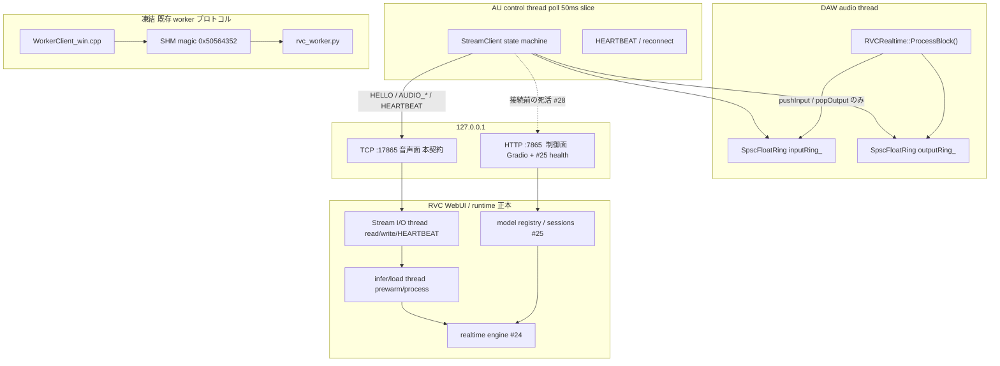
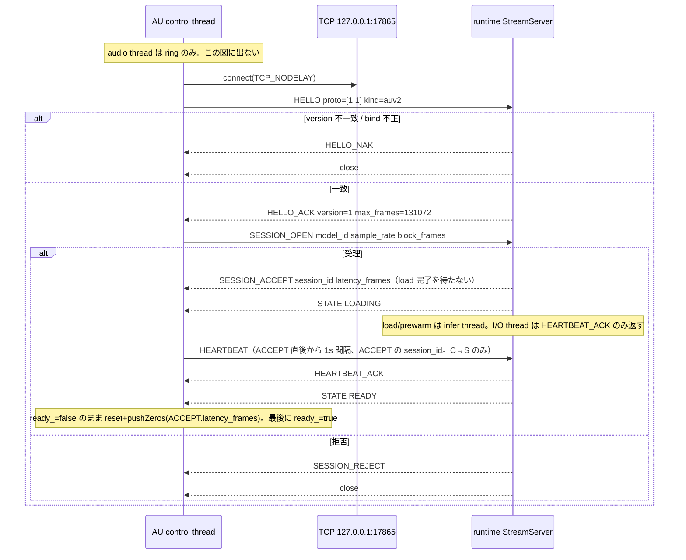
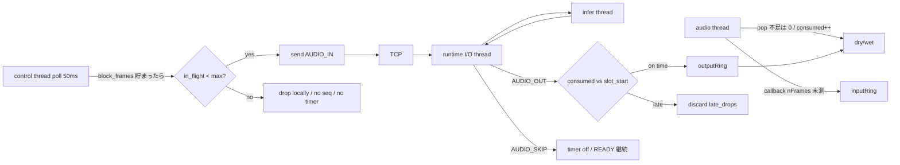
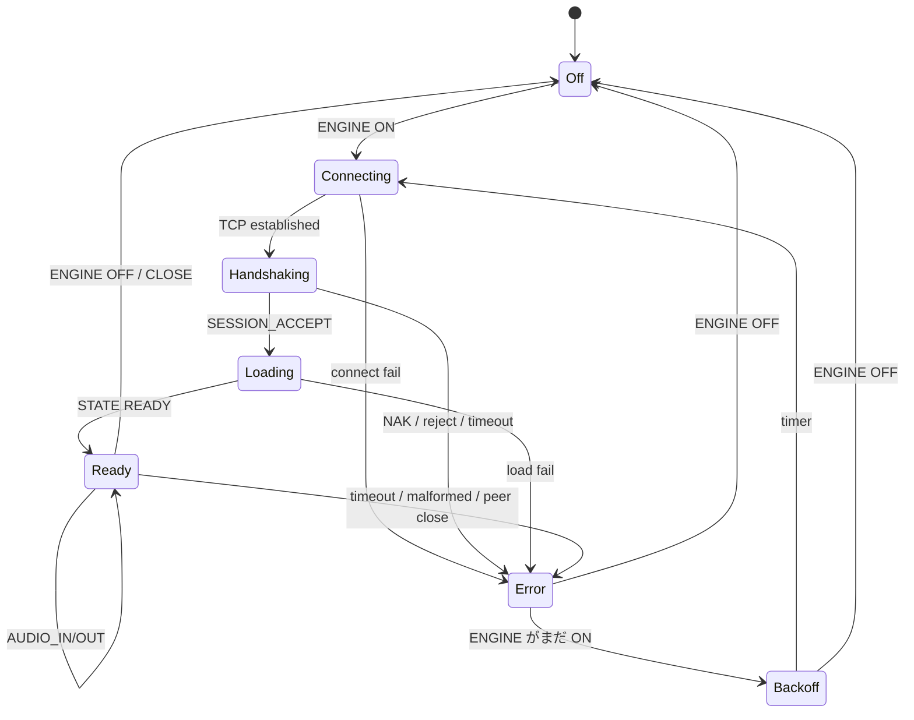
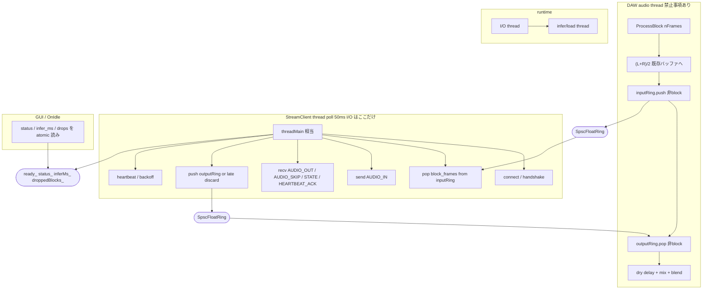

# AU audio head と RVC runtime 間の localhost バイナリストリーム契約

| 項目 | 値 |
| --- | --- |
| 文書 ID | fb46cd46 |
| 対象 Issue | [#26](https://github.com/saitoomituru/Retrieval-based-Voice-Conversion-WebUI/issues/26) |
| 親 Issue | [#23](https://github.com/saitoomituru/Retrieval-based-Voice-Conversion-WebUI/issues/23) |
| ロードマップ | [#1](https://github.com/saitoomituru/Retrieval-based-Voice-Conversion-WebUI/issues/1) |
| 対象 branch | `agent/grok-26-stream-protocol` |
| 対象 HEAD | `9ec4f76d3e59e33f336081d9d676fb75172afd75` |
| 作業ディレクトリ | `/Users/saitoumitsuru/RVC-WebUI/.worktrees/grok-26` |
| 著者 | Grok |
| 日付 | 2026-09-03 |
| 改訂 | 2026-09-03 r3（SKIP/late/gap を `commit_seq` に統一、HEARTBEAT は ACCEPT 後） |
| 状態 | Draft |
| 実装状態 | **未実装**。本文書は契約と test vector の正本であり、本番コードを変更していない |

関連 Issue（境界のみ参照、本契約の実装範囲ではない）: #3, #6, #20, #22, #24, #25, #27, #28, #29, #31。

---

## Overview

現行 `RVCRealtimeVST` は Audio Unit / VST 自身が Python worker を `posix_spawn` / `CreateProcessW` し、共有メモリ（magic `0x50564352`、protocol version 1）で推論する。この経路は Windows では実証済みである。macOS では時系列が分かれる。

- **過去（実験票 `20260903-1032`）:** プラグイン側 `shm_open(..., O_CREAT)` が GarageBand で EPERM。HEAD の `WorkerClient_mac.cpp` は `$TMPDIR` 通常ファイル + `mmap` に置換済みで、当該エラーは再発していない（Issue #22 本文）。CLI / `rvc-worker-smoke` では実推論 success。
- **現在 BLOCKED（Issue #22 / #23）:** AU が Python を in-process spawn するため child が GarageBand sandbox を継承し、OpenMP 内部 SHM2 が EPERM → `libiomp5` SIGABRT。対症療法のあと同一 process 内で 800 回超の再起動が観測された。診断ログは GarageBand container の `$TMPDIR` と shell の `$TMPDIR` が別名前空間。

本契約が解くのは **AU が Python / model を所有しないこと** である。SHM レイアウトの欠点そのものを理由にしない（代替 C 参照）。

本設計は **RVC WebUI/runtime を推論の正本**、**AU を薄い audio head** とする。リアルタイム音声は Gradio HTTP（制御面、既定 `127.0.0.1:7865`）とは別の **localhost TCP バイナリストリーム**（既定 `127.0.0.1:17865`）で運ぶ。既存 worker 共有メモリ契約は **1 bit も変更しない**。Bonjour / LAN は Issue #29 の後段であり、今回は `127.0.0.1` のみを必須とする。同一 wire frame を後から LAN へ載せる前提で、transport 固有の仮定を frame へ混ぜない。

---

## Background & Motivation

### 現行の二層と、壊してはいけないもの

プラグイン側の realtime 経路はすでに audio thread と management thread に分かれている。

```text
ProcessBlock()                         WorkerClient::threadMain()
  モノラル downmix                       posix_spawn / CreateProcessW
  inputRing_.push  (SpscFloatRing)       共有メモリへ block を書く
  outputRing_.pop                        推論完了を待つ
  dry/wet mix                            outputRing_ へ返す
```

根拠コード:

- audio callback: `RVCRealtime::ProcessBlock()`（`RVCRealtimeVST/src/RVCRealtime.cpp`）
- lock-free ring: `rvc::SpscFloatRing`（`RVCRealtimeVST/src/SpscRing.hpp`、capacity `1u << 20`）
- Windows IPC: `RVCRealtimeVST/src/WorkerClient_win.cpp`
- macOS IPC: `RVCRealtimeVST/src/WorkerClient_mac.cpp`
- Python worker: `RVCRealtimeVST/worker/rvc_worker.py`
- 公開 API: `rvc::WorkerClient::{pushInput,popOutput,isReady,threadMain}`（`RVCRealtimeVST/src/WorkerClient.hpp`）

`ProcessBlock()` は `mWorker.isReady()` が false なら passthrough（dry）へ戻る。socket / Python / allocator は audio thread に無い。この分離は新契約でも維持する。

### 現行 worker プロトコル（legacy、凍結）

| 項目 | 値 | 定義場所 |
| --- | --- | --- |
| magic | `0x50564352`（LE バイト列 `RCVP`。コメントは `RVCP`） | `WorkerClient_*.cpp` `kMagic`、`rvc_worker.py` `MAGIC` |
| protocol version | `1`（`uint32`） | `kProtocolVersion` / `PROTOCOL_VERSION` |
| header | 4096 bytes | `kHeaderBytes` / `HEADER_BYTES` |
| max frames | 131072 | `kMaxFrames` / `MAX_FRAMES` |
| map サイズ | 1,052,672 bytes | `kMapBytes` |
| 同期 | Windows named Event / POSIX sequence poll 1ms | `WinEvent` / `PosixSequenceWaiter` |
| 起動 | プラグインが Python を spawn する | `launchWorker()` |
| 推論 timeout | `max(5000, block_ms * 8)` ms | `processOneBlock()` |
| 状態 | SHM `int32`: 1 starting, 2 loading, 3 ready, -1 error, -2 stop | `rvc_worker.py` `STATUS_*` |
| UI 状態 | `kStatusOff=0 … kStatusError=4`（負数を使わない） | `RvcParameters.hpp` `WorkerStatus` |

共有メモリ header の使用 offset（LE、native struct ではない。`memcpy` / `struct.pack_into("<…")`）:

| offset | 型 | 意味 |
| --- | --- | --- |
| 0 | u32 | magic |
| 4 | u32 | protocol version |
| 8 | i32 | status |
| 12 | u32 | request sequence |
| 16 | u32 | response sequence |
| 20 | u32 | frames |
| 24 | u32 | sample_rate |
| 32 | f32 | pitch |
| 36 | f32 | formant |
| 40 | f32 | index_rate |
| 44 | f32 | rms_mix |
| 48 | f32 | threshold |
| 56 | f32 | infer_ms |
| 64 | u32 | f0_method |
| 128 | char[512] | status_text UTF-8 |
| 4096 | f32[frames] | input |
| 4096+524288 | f32[frames] | output |

このレイアウト・CLI 引数（`--map` / `--request` / `--response` / `--config`）・`rvc_worker.py` の挙動は **本 Issue の変更対象外**。Windows VST の正常系を保つ。macOS の AU 内蔵 spawn 経路は Issue #23 が「比較用 legacy として凍結し、成功正本にしない」と定義している。本契約はそれを置き換える **別プロトコル** である。

### 痛み

1. AU が Python / model path / worker lifecycle を所有している（`ValidateConfiguration()` が `infer/rtrvc.py` と `.venv/bin/python` を要求する）。
2. GarageBand in-process spawn の child は host sandbox を継承する。プラグイン側 `shm_open` は file mmap で回避済み。残っているのは Python/OpenMP 内部 SHM2 EPERM と SIGABRT、および再起動嵐である。
3. `configVersion_` 変化のたびに worker を殺して作り直す（Issue #20）。モデル cold start が再発する。
4. Gradio WebUI（`webui.py`、listen port 既定 7865）と realtime 推論が別物として分裂している。`realtime_gui.py` は sounddevice を直接所有し、AU から再利用できない（Issue #24）。
5. README / `docs/macos-build.ja.md` はまだ `WorkerClient_stub_mac.cpp` と書いており、`CMakeLists.txt` の APPLE 分岐（実ファイル `WorkerClient_mac.cpp`）と矛盾する。実装済みと誤読しないこと。

---

## Goals & Non-Goals

### Goals

- AU と RVC runtime の間に、versioned な binary stream 契約を定義する。
- fake client / fake server だけで正常・遅延・欠落・順序逆転・切断を test できる。
- audio thread が network I/O で block しないことを、関数単位で固定する。
- 1 session の audio が別 session へ混ざらない。
- protocol version 不一致は fail-fast。
- localhost `127.0.0.1` を先に実装できる粒度まで、magic / endian / framing / timeout / 所有 thread を数値で書く。
- 既存 worker プロトコルを壊さない条件を、ファイル単位で書く。
- 後段 Bonjour（#29）は同じ wire frame を使う、と境界だけ書く。

### Non-Goals（今回やらない）

- 本番コードの実装、`rvc_worker.py` / `WorkerClient_*.cpp` の改修。
- Gradio への `/health` 実装（#25）、LaunchServices（#28）、AU head 置換（#27）、engine 抽出（#24）。
- Bonjour / LAN / `_rvc-realtime._tcp`（#29）。
- TLS / PKI / pairing。localhost では必須にしない（Issue #23）。
- stereo 推論、可変 bitrate、UDP、WebRTC。
- CUDA を macOS の暗黙前提にすること。
- AUv3 / iPad。
- Windows VST をこの Issue で stream client へ移行すること（段階移行。Windows は当面 legacy SHM のまま）。

---

## Key Decisions

1. **Transport は raw TCP。binary WebSocket は採用しない。**  
   AU は C++17 の薄い head であり、WebSocket の masking / opcode / HTTP upgrade は価値より実装量が多い。Python 標準の `socket` で fake server が書ける。Gradio が既に 7865 で HTTP/WS を占有しているので、音声を同じ WS に混ぜると queue と資源競合する（#25 の観測対象）。LAN 後段でも TCP の上に同じ frame を載せる。WebSocket へ包む必要が出たら frame は再利用し、transport adapter だけ足す。

2. **既存 SHM worker 契約（magic `0x50564352`, version 1）は凍結。stream は別 magic `0x43565352`（LE バイト列 `RSVC`）。**  
   誤接続時に両者が互いのバッファを audio と解釈しないため。version 数値を共用しない（SHM は `u32` version、stream は envelope の `u16`）。

3. **制御面と音声面をポートごと分離する。**  
   制御面: 既存 Gradio HTTP `127.0.0.1:7865`（#25 が `/health` 等を足す）。  
   音声面: 本契約の TCP `127.0.0.1:17865`（7865 + 10000。衝突しにくく記憶できる）。  
   stream は handshake 自己完結とし、fake test が Gradio 無しで動く。

4. **Bind / connect 既定は IPv4 `127.0.0.1` のみ。`0.0.0.0` も `::` も禁止。**  
   Issue #23 の「localhost は 127.0.0.1 限定を既定」。IPv6 `::1` は GarageBand 許可差が未測のため v1 対象外（Open Questions）。

5. **AUDIO_IN の `frame_count` は session で合意した `block_frames` と一致させる（v1）。**  
   現行 worker と同じ。AU の host callback（典型 32–1024 frames、**実機 nFrames は未測**）との差は **AU 側 lock-free ring + control thread が集約** する。runtime は SOLA 用に固定長だけ見ればよい。

6. **sequence はアプリケーション層の欠落検出用。late は audio thread の消費 cursor で判定する。TCP 再送は再実装しない。**  
   localhost TCP は順序保証する。欠落は「送らなかった（client 入力 drop）」または「server が `AUDIO_SKIP` / seq jump で捨てた」を意味する。late は「その seq のスロットが output ring から既に pop 済み」であり、壁時計だけで決めない。`timestamp_ns` は診断専用で合否に使わない。順序逆転は fake harness が recv キューへ注入する試験項目であり、本番 TCP では起きない。

7. **reconnect は必ず新しい `session_id`。`ready_=false` を先に release してから ring を捨てる。**  
   現行 `WorkerClient_mac.cpp` `threadMain()` と同じ precondition: `resetUnsafe` / `pushZeros` 中は audio thread が ring に触れない。

8. **AU は model 実 path / Python executable / RVC root を所有しない。**  
   `SESSION_OPEN` は runtime が発行する opaque `model_id` を使う。fake は `fixture.passthrough` 等。本番の一覧は #25。HELLO_ACK の `caps_json` は v1 で必須（空委譲しない）。

9. **audio thread の許可リストは現行 `ProcessBlock()` と同一。**  
   downmix、`pushInput` / `popOutput`（`ready_==true` のときだけ）、dry delay、mix、`consumed_frames` atomic 加算。禁止: `recv`/`send`/`connect`/`poll`、mutex、`malloc`、Python、ファイル I/O、ログ、`resetUnsafe`。

10. **Windows 互換は「触らない」で守る。adapter 追加のみ。**  
    `WorkerClient_win.cpp` / `WorkerClient_mac.cpp` / `rvc_worker.py` を stream 用に書き換えない。`WorkerClient` に純仮想を足さない。CMake の `WIN32` 分岐は維持。

11. **socket I/O と load/infer は別 thread。HEARTBEAT は LOADING 中も infer 中も生きる。**  
    runtime は listen/read/write/`HEARTBEAT_ACK` を I/O thread で行い、`engine.prewarm()` / `process()` は infer thread へ渡す。client control thread は単一なら `poll`/`select` で send/recv/timer を多重化し、1 回の stall 上限を `RSVC_IO_SLICE_MS=50` とする。HEARTBEAT の timer 開始点は **`SESSION_ACCEPT` 直後**（この時点で `session_id` が確定する。`session_id=0` の HEARTBEAT は送らない）。3s 未着だけが死であり、180s load や 5s infer 待ちそのものは HEARTBEAT を止めない。v1 の HEARTBEAT は **C→S のみ**。server は `HEARTBEAT_ACK` だけを返す。

12. **server の backpressure drop は session を殺さない。**  
    捨てた seq は `AUDIO_SKIP` で知らせる。client は `commit_seq(N, pcm=None)` で timer 解除・必要なら 0 を ring へ push・`next_play_seq` を進める。session は READY。infer timeout は「skip も OUT も来ない」ときだけ ERROR にする。

---

## Proposed Design

### 全体配置



AU は Python child を持たない。runtime が先に起動している（#28 の手動起動でもよい）。ENGINE OFF は session CLOSE であり、runtime process 終了ではない。

### protocol version

| 定数 | 値 | 備考 |
| --- | --- | --- |
| `RSVC_MAGIC` | `0x43565352` | LE バイト列 `52 53 56 43` = `RSVC` |
| `RSVC_PROTO_VERSION` | `1` | envelope の `u16`。SHM の `u32` version 1 とは別空間 |
| `RSVC_HEADER_BYTES` | `32` | 固定。padding なし |
| `RSVC_MAX_PAYLOAD_BYTES` | `1048576` | 1 MiB。超過は即 close |
| `RSVC_MAX_FRAMES` | `131072` | 現行 worker と同じ上限 |
| `RSVC_MAX_STRING_BYTES` | `1024` | 1 文字列の上限 |
| `RSVC_DEFAULT_HOST` | `127.0.0.1` | 文字列。DNS しない |
| `RSVC_DEFAULT_PORT` | `17865` | `uint16` |
| `RSVC_TCP_NODELAY` | 必須 | Nagle 禁止 |
| `RSVC_SO_REUSEADDR` | 必須 | listen 側。TIME_WAIT 後の再 bind 用。`SO_REUSEPORT` は使わない（二重 listen 禁止） |
| `RSVC_HEARTBEAT_INTERVAL_MS` | `1000` | **`SESSION_ACCEPT` 直後から。** LOADING / infer 中も継続。HELLO→ACCEPT は `HELLO` / `SESSION_OPEN` の timeout が担う |
| `RSVC_HEARTBEAT_TIMEOUT_MS` | `3000` | ACK 未着 3s で死。load 180s や infer 5s より短いので I/O を infer と同一 thread にしてはならない |
| `RSVC_HELLO_TIMEOUT_MS` | `1000` | v1 / fake の値。loopback RTT は未測（0.05–0.5 ms 想定）。実測後に下げてよい。50 ms は CI の GIL / 負荷でちらつくので採用しない |
| `RSVC_IO_SLICE_MS` | `50` | client control thread の `poll`/`select` 1 回上限。これ以上 socket で stall しない |
| `RSVC_SESSION_OPEN_TIMEOUT_MS` | `180000` | モデル load + prewarm。`worker_smoke.cpp` の 180s に合わせる。この間 HEARTBEAT は生きる |
| `RSVC_INFER_TIMEOUT_MS(block_ms)` | `max(5000, block_ms * 8)` | 現行 `processOneBlock()` と同一式。当該 seq に `AUDIO_OUT` も `AUDIO_SKIP` も無いときだけ発火 |
| `RSVC_DEFAULT_MAX_IN_FLIGHT` | `2` | 未応答 AUDIO_IN の上限 |
| `RSVC_ASSEMBLY_TIMEOUT_MS` | `3000` | header 後 payload が揃わない |

v1 に minor version は無い。拡張は `HELLO` の `client_flags` / `HELLO_ACK` の `server_flags` と、未知 `frame_type` の fail-fast で行う。受信側が理解できない type を「無視して継続」してはならない（順序と session 分離が壊れる）。

### エンディアンと packing

- すべての整数・IEEE754 float は **little-endian**。
- **C struct の自然 align を wire に出さない。** `struct.pack` / `memcpy` で逐次 pack する。
- 文字列は UTF-8、NUL 終端なし、直前の `u16` length がバイト数。length=0 は空文字。length > 1024 は malformed。
- サンプルは **IEEE754 binary32 LE、interleaved**。v1 は mono のみなので interleaved は実質 packed mono。
- ホストが big-endian であることは想定しない（対象は Windows x64 と macOS x86_64 / 将来の Apple Silicon）。変換が必要なら adapter で行う。

### Frame envelope（全メッセージ共通）

32 bytes、その直後に payload `payload_bytes` バイト。frame 間 padding なし。

| offset | 型 | フィールド | 規則 |
| --- | --- | --- | --- |
| 0 | u32 | `magic` | 必ず `0x43565352` |
| 4 | u16 | `proto_version` | 送信時点の契約。v1 では `1` |
| 6 | u16 | `frame_type` | 下表 |
| 8 | u32 | `session_id` | handshake 完了前は `0`。以降は `SESSION_ACCEPT` の値 |
| 12 | u32 | `sequence` | 方向別。下記 |
| 16 | u32 | `payload_bytes` | 0 以上、`<= 1048576` |
| 20 | u32 | `crc32` | v1 送信者は **必ず 0**。フィールドは将来用に残す。受信側が非 0 を見たら `ERROR` code 17 `CRC_INVALID` + close。検証も 3-strike も resync もしない |
| 24 | u64 | `timestamp_ns` | 送信側 monotonic。**v1 は診断専用で合否に使わない。** 未設定なら 0。late 判定は `consumed_frames` cursor |

Python pack:

```python
HEADER_FMT = "<IHHIIIIQ"  # 32 bytes
struct.pack(HEADER_FMT, magic, proto_version, frame_type,
            session_id, sequence, payload_bytes, crc32, timestamp_ns)
```

#### `frame_type`

| 値 | 名前 | 方向 | `session_id` | `sequence` の意味 |
| --- | --- | --- | --- | --- |
| `0x0001` | `HELLO` | C→S | 0 | 0 |
| `0x0002` | `HELLO_ACK` | S→C | 0 | 0 |
| `0x0003` | `HELLO_NAK` | S→C | 0 | 0 |
| `0x0010` | `SESSION_OPEN` | C→S | 0 | `request_id` と独立。envelope sequence=0 |
| `0x0011` | `SESSION_ACCEPT` | S→C | **新 id** | 0 |
| `0x0012` | `SESSION_REJECT` | S→C | 0 | 0 |
| `0x0020` | `CONFIG_UPDATE` | C→S | 必須 | client config seq（1 始まり） |
| `0x0021` | `CONFIG_ACK` | S→C | 必須 | 対応する config seq |
| `0x0030` | `AUDIO_IN` | C→S | 必須 | client audio seq（1 始まり、単調増加） |
| `0x0031` | `AUDIO_OUT` | S→C | 必須 | **入力 seq を echo** |
| `0x0032` | `AUDIO_SKIP` | S→C | 必須 | **捨てた入力 seq を echo** |
| `0x0040` | `STATE` | S→C | 必須（ACCEPT 前は 0） | server state seq |
| `0x0041` | `HEARTBEAT` | **C→S のみ（v1）** | **当該 session_id 必須**（ACCEPT 前は送らない） | heartbeat seq |
| `0x0042` | `HEARTBEAT_ACK` | S→C のみ | echo | echo |
| `0x0050` | `ERROR` | 双方向 | 分かればセット | 0 |
| `0x0051` | `CLOSE` | 双方向 | 必須（未 open なら 0） | 0 |

未知の type: `ERROR` code 4 `UNKNOWN_TYPE` を送れれば送り、connection を close する。

v1 で HEARTBEAT を送るのは client だけである。server が HEARTBEAT を発してはならない（ACK のみ）。ACCEPT 前の HEARTBEAT、および ACCEPT 後の `session_id=0` は `SESSION_MISMATCH`（code 5、fatal）。server は load 完了を待たず `SESSION_ACCEPT`（`initial_state=LOADING` 可）を返し、その直後から HEARTBEAT が `session_id` 付きで成立するようにする。

### handshake



規則:

1. connect 後、client が最初に送る frame は `HELLO` のみ。server が先に話してはならない。
2. `HELLO` 以外が先に来たら server は即 close（ERROR を送らない。相手が SHM worker の可能性）。
3. `HELLO.magic` 不一致も即 close。
4. `client_proto_min..max` に server の version が含まれなければ `HELLO_NAK` (`PROTOCOL_VERSION_MISMATCH`) して close。
5. 1 TCP connection につき session は **最大 1**。複数 session は複数 connection（AU instance ごと）。model 重みの共有は runtime 内部（#25）であり wire に出さない。
6. `SESSION_ACCEPT` 以前の `AUDIO_IN` は malformed。
7. `STATE READY`（または `SESSION_ACCEPT.initial_state==READY`）を受けるまで client は `AUDIO_IN` を送らない。audio thread は `ready_` false のまま dry。
8. client は **`SESSION_ACCEPT` を受けた直後**から HEARTBEAT を 1000 ms 間隔で送る。envelope `session_id` は ACCEPT の値。LOADING 中も止めない。server は infer thread が block していても I/O thread が `HEARTBEAT_ACK` を返す。server から HEARTBEAT は送らない。
9. `HELLO` 待ちは `RSVC_HELLO_TIMEOUT_MS=1000`。50 ms では fake T1 が CI でちらつく。HELLO_ACK→ACCEPT は通常 1s 未満。load は ACCEPT 後（`initial_state=LOADING`）に行い、HEARTBEAT の対象にする。

#### `HELLO` payload

| offset | 型 | フィールド |
| --- | --- | --- |
| 0 | u16 | `client_proto_min` |
| 2 | u16 | `client_proto_max` |
| 4 | u32 | `client_flags`（bit0 は予約・v1 は 0。bit1=stereo 要求。v1 で bit1 を立てたら NAK） |
| 8 | u8 | `client_kind`: 1=`fake_test`, 2=`auv2`, 3=`vst`, 4=`app` |
| 9 | u8 | `reserved` = 0 |
| 10 | u16 | `client_name_len` |
| 12 | bytes | `client_name` |
| 12+n | u16 | `client_build_len` |
| 14+n | bytes | `client_build` |

`client_name_len` は 1..1024。

#### `HELLO_ACK` payload

| offset | 型 | フィールド |
| --- | --- | --- |
| 0 | u16 | `chosen_proto_version`（=1） |
| 2 | u16 | `reserved` = 0 |
| 4 | u32 | `server_flags`（v1 は 0。bit0 は将来 crc 用に予約。v1 で立ててはならない） |
| 8 | u32 | `max_payload_bytes`（<= 1048576） |
| 12 | u32 | `max_frame_count`（<= 131072） |
| 16 | u32 | `heartbeat_interval_ms` |
| 20 | u32 | `max_sessions_total`（runtime 全体。参考値） |
| 24 | u16 | `server_name_len` |
| 26 | bytes | `server_name` |
| 26+n | u16 | `caps_json_len` |
| 28+n | bytes | `caps_json` UTF-8。**v1 は length > 0 必須。** HTTP `GET /capabilities`（#25）は重複してよいが、空にして委譲してはならない |

`caps_json` 最小形（fake も runtime も必須）:

```json
{
  "protocol_version": 1,
  "backends": ["cpu"],
  "sample_rates": [44100, 48000],
  "max_sessions": 4,
  "models": [
    {"id": "fixture.passthrough", "name": "passthrough"},
    {"id": "fixture.silence", "name": "silence"}
  ]
}
```

`backends` に `cuda` を書くのは実行環境が CUDA を実測できたときだけ。macOS 既定は `cpu`。ONNX / MPS は実測後に足す。

#### `HELLO_NAK` / `SESSION_REJECT` / `ERROR` payload（共通）

| offset | 型 | フィールド |
| --- | --- | --- |
| 0 | u32 | `error_code`（下表。0 は送らない） |
| 4 | u32 | `flags`（0） |
| 8 | u16 | `message_len` |
| 10 | bytes | `message` UTF-8。ログ用。秘密（絶対 path、token）を入れない |

未知の `error_code` を受けた側は `MALFORMED_FRAME` 相当として close する。

#### `error_code` 数値（v1 固定）

| code | 名前 | `fatal_close` | 使う frame |
| --- | --- | --- | --- |
| 0 | （予約。ERROR/NAK に載せない） | — | — |
| 1 | `PROTOCOL_VERSION_MISMATCH` | true | `HELLO_NAK` |
| 2 | `MALFORMED_FRAME` | true | `ERROR` |
| 3 | `PAYLOAD_TOO_LARGE` | true | `ERROR` |
| 4 | `UNKNOWN_TYPE` | true | `ERROR` |
| 5 | `SESSION_MISMATCH` | true | `ERROR` |
| 6 | `SAMPLE_RATE_UNSUPPORTED` | true | `SESSION_REJECT` |
| 7 | `CHANNELS_UNSUPPORTED` | true | `SESSION_REJECT` |
| 8 | `FRAME_COUNT_MISMATCH` | true | `ERROR` / `SESSION_REJECT` |
| 9 | `MODEL_NOT_FOUND` | true | `SESSION_REJECT` |
| 10 | `MODEL_LOAD_FAILED` | true | `ERROR` |
| 11 | `TIMEOUT` | true | `ERROR`（infer。AUDIO_SKIP が来た seq では出さない） |
| 12 | `HEARTBEAT_TIMEOUT` | true | `ERROR`（送らず局所遷移でも可。送るならこの値） |
| 13 | `SESSION_LIMIT` | true | `SESSION_REJECT` |
| 14 | `UNAUTHORIZED_BIND` | true | 局所。非 loopback へは socket を開かない。wire に出さなくてよい |
| 15 | `INTERNAL` | true | `ERROR` |
| 16 | `PEER_CLOSED` | true | 局所（FIN/RST）。ERROR frame は送れないことが多い |
| 17 | `CRC_INVALID` | true | `ERROR`（v1 で `crc32≠0` を見たとき） |

`fatal_close=true` は ERROR/NAK/REJECT のあと TCP を閉じる。session を READY のまま続ける事象（入力 drop、late discard、CONFIG 拒否）は **ERROR frame を使わない**。

CONFIG 失敗は `CONFIG_ACK.status≠0` のみ。ERROR にしない。session 継続。

### sample rate / channel / frame size

#### `SESSION_OPEN` payload

| offset | 型 | フィールド |
| --- | --- | --- |
| 0 | u32 | `request_id`（client 発行、ACCEPT/REJECT が echo） |
| 4 | u32 | `sample_rate` Hz |
| 8 | u16 | `channels`。v1 は `1` のみ |
| 10 | u16 | `sample_format`。`1` = f32le |
| 12 | u32 | `block_frames` |
| 16 | u32 | `crossfade_frames` |
| 20 | u32 | `extra_frames` |
| 24 | u32 | `flags`（bit0=`prewarm` 要求。本番 AU は立てる） |
| 28 | u16 | `model_id_len` |
| 30 | bytes | `model_id` |
| 30+n | u16 | `index_id_len` |
| 32+n | bytes | `index_id`（空可） |
| 32+n+m | u16 | `auth_token_len` |
| 34+n+m | bytes | `auth_token`（localhost v1 は空。#25 が後で埋める） |

#### `SESSION_ACCEPT` payload

| offset | 型 | フィールド |
| --- | --- | --- |
| 0 | u32 | `request_id` echo |
| 4 | u32 | `session_id` **0 以外。runtime 再起動を跨いで再利用禁止** |
| 8 | u32 | `sample_rate`（echo または拒否。v1 は変更しない） |
| 12 | u16 | `channels` |
| 14 | u16 | `sample_format` |
| 16 | u32 | `block_frames` |
| 20 | u32 | `crossfade_frames` |
| 24 | u32 | `extra_frames` |
| 28 | u32 | `latency_frames`（**v1 の正本**。既定 `2 * block_frames`） |
| 32 | u32 | `max_in_flight` |
| 36 | u32 | `initial_state`（2=LOADING または 3=READY） |

`latency_frames` の正本は `SESSION_ACCEPT` である。AU は READY 時に `SetLatency` と dry delay（`mTargetDelayFrames`）と output ring の `pushZeros` の **三点すべて** にこの値を入れる。`RVCRealtime::CalculateLatencyFrames()` は **未接続時の DAW 報告 fallback** に限り使う。session 中に変えない。変えるなら CLOSE + 再 OPEN。fake T1 は ACCEPT に `2 * block_frames` を入れ、client の prefill がそれに一致することを見る。

#### 数値契約（現行実装と一致させる）

`block_frames` の算出は `WorkerClient::calculateBlockFrames()` および `rvc_worker.py` `RVCStreamEngine.__init__` と同じ:

```text
zc = max(1, floor(sample_rate / 100))
block_frames = round(block_ms / 1000 * sample_rate / zc) * zc
block_frames = clamp(block_frames, zc, 131072)
```

`crossfade_frames` / `extra_frames` も同様に zc 量子化。SOLA overlap は runtime 内部で `min(crossfade_frames, 4 * zc)`（40 ms cap）。wire には effective 値を `STATE` message で返してよい。

プラグイン UI の範囲（`RVCRealtime.cpp` コンストラクタ）:

| パラメータ | 既定 | 範囲 |
| --- | --- | --- |
| Block | 130 ms | 20–1000 |
| Crossfade | 80 ms | 10–100 |
| Context | 2000 ms | 500–3000 |
| Pitch | 12 st | -24–24 |
| Formant | 0 | -12–12 |
| Index | 0 | 0–1 |
| RMS Mix | 0.5 | 0–1 |
| Gate | -60 dB | -60–0 |
| F0 | 0 RMVPE | 0 RMVPE, 1 FCPE, 2 PM |
| チャネル I/O | `1-1 1-2 2-2` | `config.h` `PLUG_CHANNEL_IO` |
| 報告 latency（未接続 fallback） | `2 * block_frames` | `CalculateLatencyFrames()` / `PLUG_LATENCY 12480` |

代表値（実装がこの表と違う値を出したら test 失敗）。512-frame 周期は **48 kHz での計算値であり、GarageBand/Logic の実機 `nFrames` は未測**。

| sample_rate | block_ms | zc | block_frames | latency_frames | 512-frame 周期（未測の典型計算） |
| --- | --- | --- | --- | --- | --- |
| 44100 | 20 | 441 | 882 | 1764 | 11.61 ms |
| 44100 | 130 | 441 | 5733 | 11466 | 11.61 ms |
| 48000 | 20 | 480 | 960 | 1920 | 10.67 ms |
| 48000 | 130 | 480 | 6240 | 12480 | 10.67 ms |
| 48000 | 250 | 480 | 12000 | 24000 | 10.67 ms |
| 96000 | 130 | 960 | 12480 | 24960 | 5.33 ms |

v1 で server が受け入れる sample_rate: **44100 と 48000 を必須**。96000 は capabilities に出したときだけ。それ以外は `SESSION_REJECT` (`SAMPLE_RATE_UNSUPPORTED`)。

channels: v1 は 1。AU の stereo 入力は現行どおり `ProcessBlock()` が `(L+R)/2` してから ring へ入れる。変換結果は両チャネルへ同じ wet を書く。これは **AU adapter の責務** であり stream は mono。

`client_kind=fake_test` のときだけ、server は zc 整列を強制しなくてよい（8-frame の framing test を許す）。`client_kind=auv2` では zc 非整列を `SESSION_REJECT` (`FRAME_COUNT_MISMATCH`)。

#### AUDIO payload（IN/OUT 共通先頭）

| offset | 型 | フィールド |
| --- | --- | --- |
| 0 | u32 | `sample_rate`（session と不一致なら ERROR code 6 + close） |
| 4 | u16 | `channels` |
| 6 | u16 | `sample_format` = 1 |
| 8 | u32 | `frame_count`（v1 では `== block_frames`） |
| 12 | u64 | `host_timestamp_ns`（AUDIO_IN は AU monotonic。AUDIO_OUT は echo。**合否に使わない**） |
| 20 | u32 | `flags`（bit0=`discontinuous`: ring underrun 後の最初の block） |
| 24 | f32×`frame_count*channels` | PCM |

payload_bytes = `24 + 4 * frame_count * channels`。これが合わなければ malformed。

#### `AUDIO_SKIP` payload（8 bytes）

| offset | 型 | フィールド |
| --- | --- | --- |
| 0 | u32 | `seq`（捨てた `AUDIO_IN.sequence`） |
| 4 | u32 | `reason`（1=`server_backpressure`、2=`late_on_server`、3=`replaced_by_gap`） |

envelope の `sequence` も同じ `seq`。client はこの frame を AUDIO_OUT の代わりに扱い、PCM は無い。

### sequence と欠落検出

方向:

- **client audio sequence**: `AUDIO_IN` ごとに +1。1 始まり。wrap は 2^32。wrap 近傍は session を張り直す（連続稼働 130 ms block で約 6.4 日）。
- **server audio sequence**: `AUDIO_OUT.sequence` および `AUDIO_SKIP.sequence` は対応する `AUDIO_IN.sequence` を echo。付け替えない。
- 欠落した入力 seq に対する `AUDIO_OUT` は送らない。代わりに **`AUDIO_SKIP` を必ず送る**（T6 の jump だけに頼らない）。
- client が規則 2 で送らなかった block は seq を消費しない（timer も武装しない）。

#### playhead cursor（late の正本）

READY 成立直後:

- `consumed_frames = 0`（audio thread が output ring から pop した累計。atomic）
- output ring には `SESSION_ACCEPT.latency_frames` の 0 が入っている
- seq `N` の wet スロット開始位置: `slot_start(N) = latency_frames + (N - 1) * block_frames`

`ProcessBlock` が `ready_==true` のあいだ `nFrames` を pop したら `consumed_frames += nFrames`（実際に pop できた数。不足分の 0 埋めも消費と数える）。

#### 共通関数 `commit_seq(N, pcm)`

`AUDIO_OUT` / `AUDIO_SKIP` / gap の **唯一の** 副作用経路。枝ごとに push や `next_play_seq` を変えない。`pcm` は `AUDIO_OUT` のときだけ長さ `block_frames` の float 配列。SKIP と gap は `pcm=None`。

```text
commit_seq(N, pcm):
  # (1) timer
  if timer_armed(N):
      cancel_timer(N)
      in_flight = max(0, in_flight - 1)

  if N < next_play_seq:
      dup_drops += 1
      return                    # push しない。next_play_seq も動かさない

  start = slot_start(N)
  end   = start + block_frames

  # (2)(3) ring
  if consumed_frames >= end:
      # スロット全体が既に underrun 0 で再生済み。PCM も 0 も push しない
      if pcm is not None: late_drops += 1
      else: dropped_blocks += 1
  elif consumed_frames > start:
      # 部分消費。残りだけ 0。PCM は捨てる（時間軸を伸ばさない・縮めない）
      outputRing.pushZeros(end - consumed_frames)
      if pcm is not None: late_drops += 1
      else: dropped_blocks += 1
  else:
      # 未到達。AUDIO_OUT on-time だけ PCM。それ以外は必ず block_frames 個の 0
      if pcm is not None:
          outputRing.push(pcm, block_frames)
      else:
          outputRing.pushZeros(block_frames)
          dropped_blocks += 1

  # (4) late / SKIP / gap でも進める
  next_play_seq = N + 1
```

呼び出し:

```text
on_audio_out(N, pcm):
    while next_play_seq < N:
        commit_seq(next_play_seq, None)   # gap = SKIP 相当。OR なし
    commit_seq(N, pcm)

on_audio_skip(N):
    while next_play_seq < N:
        commit_seq(next_play_seq, None)
    commit_seq(N, None)
    # session は READY のまま。HEARTBEAT 継続。この seq では ERROR 11 を出さない
```

`in_flight` の `--` は `commit_seq` の (1) だけが行う。gap の `while` は不足 seq を 1 回ずつ通すので二重減算しない（武装していなければ (1) は何もしない）。

これで `[prefill][seq1]` のあと seq2 SKIP → seq3 AUDIO_OUT とすると、ring は `[prefill][seq1][zeros x block_frames][seq3 PCM]` になる。seq3 が seq1 の直後に来ることはない。seq2 スロットが既に underrun で消費済みなら 0 は足さず、その underrun が時間を埋めたあとに seq3 が並ぶ。

`timestamp_ns` / `host_timestamp_ns` は receipt と RTT 診断だけに使う。late 合否には使わない。

`CONFIG_UPDATE` は audio seq を消費しない。適用は「次の `AUDIO_IN` 以降」。

### ready / loading / error / stop 状態

`STATE.payload`:

| offset | 型 | フィールド |
| --- | --- | --- |
| 0 | u32 | `state` |
| 4 | u32 | `subcode`（error_code または 0） |
| 8 | u32 | `dropped_blocks`（server 側累計） |
| 12 | f32 | `last_infer_ms` |
| 16 | u32 | `last_dropped_seq`（0=なし。AUDIO_SKIP の補助。正本は AUDIO_SKIP） |
| 20 | u32 | `flags` |
| 24 | u16 | `message_len` |
| 26 | bytes | `message` |

`state` は **UI 向け `WorkerStatus` を拡張**したもの。SHM の負数は使わない。

| 値 | 名前 | AU `ready_` | `ProcessBlock` | 意味 |
| --- | --- | --- | --- | --- |
| 0 | `OFF` | false | dry | ENGINE OFF / 未接続 |
| 1 | `STARTING` | false | dry | TCP connect / HELLO 中 |
| 2 | `LOADING` | false | dry | model load / prewarm |
| 3 | `READY` | true | wet 経路 | AUDIO 送受信可 |
| 4 | `ERROR` | false | dry | 回復には reconnect または ENGINE OFF |
| 5 | `STOP` | false | dry | 正常 CLOSE 後。runtime は生存 |

AU 表示は既存 `StatusName()` を再利用し、`STOP` は `ENGINE OFF` と出してよい。`kStatusError=4` と SHM `-1` を混同しない。`STATE STOP=5` を `RvcParameters.hpp` へ足すのは **#27**。そのとき `ParameterId` 数値を詰め直さない（Windows 条件）。

遷移表（server。不正遷移は `ERROR` code 15 `INTERNAL` + close）:

| 現在 | 入力 | 次 |
| --- | --- | --- |
| （listen） | accept + 正しい HELLO | STARTING（ACK 後、session 前） |
| STARTING | SESSION_OPEN 成功 | LOADING または READY |
| LOADING | prewarm 完了 | READY |
| LOADING | 失敗 | ERROR |
| LOADING | HEARTBEAT | LOADING（ACK して継続。死なない） |
| READY | CLOSE / ENGINE 相当 | STOP |
| READY | infer 例外 / **skip も OUT も無い** timeout | ERROR |
| READY | AUDIO_SKIP / late discard | READY |
| READY | HEARTBEAT | READY |
| ERROR | TCP close | （connection 終了） |
| STARTING/LOADING/READY | heartbeat ACK 未着 3000 ms | ERROR code 12 |

#### `ready_` と `resetUnsafe` の順序（audio thread 契約）

`SpscFloatRing::resetUnsafe()` は `read_`/`write_` を relaxed で 0 にするだけなので、audio thread の `push`/`pop` と並行してはならない。現行 `WorkerClient_mac.cpp` `threadMain()` は `if (!ready_)` の中で reset し、その後 `ready_.store(true, release)` する。`ProcessBlock()` は `isReady()` が false なら ring に触れない。この precondition を新契約でも固定する。

**READY へ上がるとき（control thread のみ）:**

1. `ready_` は既に false（acquire で確認）。true なら先に手順「下がるとき」を行う。
2. 旧 session の未適用 AUDIO_OUT / AUDIO_SKIP を破棄。
3. `inputRing_.resetUnsafe()`
4. `outputRing_.resetUnsafe()`
5. `outputRing_.pushZeros(SESSION_ACCEPT.latency_frames)`
6. `next_play_seq = 1`、`in_flight = 0`、`consumed_frames = 0`、`late_drops = 0`
7. **最後に** `ready_.store(true, std::memory_order_release)`

**ERROR / CLOSE / reconnect 開始で下がるとき:**

1. **最初に** `ready_.store(false, std::memory_order_release)`
2. その後に socket close、timer 破棄、（必要なら）reset。audio thread の次の `ProcessBlock` は acquire load で false を見たら passthrough のみ。

fake の callback 相当は socket syscall 禁止に加え **`resetUnsafe` 禁止**。

### backpressure と timeout



定量:

| 項目 | 値 | 根拠 |
| --- | --- | --- |
| AU callback 周期 @48 kHz/512 | 10.67 ms | **典型値（未測）**。GarageBand 実験票に I/O buffer 実測は無い |
| AU callback @48 kHz/64 | 1.33 ms | **典型値（未測）** |
| lock-free push/pop 予算 | << 1 ms（目標 < 50 µs） | audio thread |
| control I/O slice | 50 ms | HEARTBEAT 1000 ms より十分短い |
| localhost TCP RTT | 0.05–0.5 ms 想定（**未測。#31**） | loopback |
| Nagle 放置時の追加遅延 | 最大 ~40 ms | だから TCP_NODELAY 必須 |
| 既定 infer timeout @130 ms | 5000 ms | `max(5000, 1040)`。AUDIO_SKIP でキャンセル |
| 既定 infer timeout @1000 ms | 8000 ms | `max(5000, 8000)` |
| 観測 infer_ms（Intel CPU, OMP=1） | 549–1097 ms / 6240 frames | 実験票 20260903-1030 / 1048。3s HEARTBEAT より短いが timeout 上限 5–8s は超える |
| 報告 latency @48 kHz/130 ms | 260 ms（12480 frames） | ACCEPT 正本。現行 `* 2` と一致させる |

**CPU では infer_ms が block_ms と latency を超える。** 本契約は魔法の低遅延を主張しない。超えた分は playhead late discard と dry 埋めになる。session 中に `latency_frames` は変えない。

control thread 送信ルール:

1. `poll`/`select` の timeout は `RSVC_IO_SLICE_MS=50`。1 ms の裸 sleep で HEARTBEAT を止めない。
2. `inputRing_.readable() < block_frames` なら次の poll へ。
3. `in_flight >= max_in_flight` ならその block を pop して捨て、`dropped_blocks++`。**seq を振らない。timer を武装しない。送らない。**
4. 送ったら `in_flight++`、その seq の infer timer を武装。
5. timer 解除と `in_flight--` は **`commit_seq` の (1) だけ**が行う（AUDIO_OUT / AUDIO_SKIP / gap の `while` から同じ関数へ入る）。
6. 武装中の seq が `RSVC_INFER_TIMEOUT_MS` 以内に OUT も SKIP も無ければ `ERROR` code 11 `TIMEOUT`、`ready_=false` を先に store、dry、reconnect。audio thread は待たない。
7. `send()` EAGAIN は control thread が 50 ms slice 内で再試行。slice を超えたらその block を local drop（規則 3 と同じ。未送信なので timer なし）。
8. `recv` は非 blocking + poll。audio callback からは呼ばない。socket を audio thread と共有しない。control 内で mutex が要るなら control 側のみ。

runtime 側:

1. **I/O thread** が read/write/HEARTBEAT_ACK/AUDIO_SKIP を担当。`prewarm` / `process` は **infer thread**（session あたり直列。SOLA のため）。
2. 受信キュー（未推論 AUDIO_IN）が `max_in_flight` を超えたら新しい AUDIO_IN を読んだ直後に捨て、**すぐ `AUDIO_SKIP` reason=1** を返す。古い in-flight を優先して終わらせる。STATE.dropped_blocks も更新。
3. 推論中に CLOSE が来たら現在 block を破棄して STOP。部分 AUDIO_OUT を送らない。
4. LOADING 中、infer thread が 180s かかっても I/O thread は HEARTBEAT_ACK を返す。

### reconnect



規則:

1. reconnect は **新しい TCP + 新しい HELLO + 新しい session_id**。
2. 旧 `session_id` の frame を新 connection で見たら破棄（通常は届かない）。
3. 下がるとき **最初に** `ready_.store(false, release)`。その後旧 socket を close。旧 wet を再生しない。
4. 次の READY で reset + `pushZeros(ACCEPT.latency_frames)` し、**最後に** `ready_=true`。
5. backoff: 200 ms, 400 ms, 800 ms, 1600 ms, 3200 ms, その後 5000 ms 固定。成功で 200 ms に戻す。この表は **#27 StreamClient に含める**（#26 の fake は backoff を時計で検証すれば足りる）。
6. **spawn storm 禁止。** AU は Python を起動しない。接続失敗を 1 ms 間隔で繰り返さない。Issue #22 の 800 回生成が反面教師。
7. ENGINE OFF で backoff を打ち切り、`CLOSE` を送れれば送り、socket を閉じる。runtime は生きたまま。
8. 同一 AU instance が旧 socket を残したまま新 socket で AUDIO を送ってはならない。切り替える前に旧 fd を close。server が旧 connection を見たら旧側へ `CLOSE reason=4 replaced` を送り FIN する。

### runtime 死活確認

層を分ける。

| 層 | 手段 | 担当 Issue | 周期 | 失敗時 |
| --- | --- | --- | --- | --- |
| 接続前 | HTTP `GET /health`（#25） | #28 | connect 直前 1 回、以降 5 s でも可 | STARTING 表示。LaunchServices は #28 |
| 接続後 | TCP 生存 + `HEARTBEAT` | 本契約 | 1000 ms（**SESSION_ACCEPT 直後開始**、C→S のみ） | 3000 ms で ERROR code 12、dry、reconnect。LOADING/infer 中も I/O thread が ACK |
| 推論 | AUDIO_OUT または AUDIO_SKIP | 本契約 | block ごと | 両方無いときだけ ERROR code 11 |

`HEARTBEAT` payload:

| offset | 型 | フィールド |
| --- | --- | --- |
| 0 | u64 | `sender_monotonic_ns` |
| 8 | u32 | `flags` |

`HEARTBEAT_ACK` はそれを echo し、続けて `u64 responder_monotonic_ns` を付ける（payload 16 bytes）。RTT 見積もりは control thread のメトリクス。audio thread は見ない。

v1 では **client だけが HEARTBEAT を送り、server は HEARTBEAT_ACK だけを返す。** server から HEARTBEAT を送ってはならない。envelope `session_id` は ACCEPT の値。0 は送らない（送れば code 5）。

TCP RST / FIN: 即座に ERROR code 16 `PEER_CLOSED`（送れなければ局所遷移）、HEARTBEAT 待ちにしない。

`/health` が 200 でも stream port が閉じている場合: connect 失敗として STARTING→ERROR。両者を同一とみなさない。

### malformed packet 処理

原則: **信用できないバイト列のあとに同じ socket で復旧しようとしない。** 同期がずれる。

| 事象 | 検出 | 応答（code） | connection |
| --- | --- | --- | --- |
| 先頭 4 byte が `RSVC` でも `RVCP`(SHM) でもない | header | 何も送らない | 即 close |
| SHM magic `RCVP` | header | 何も送らない | 即 close |
| `payload_bytes > 1048576` | header | ERROR 3 `PAYLOAD_TOO_LARGE` | close |
| header 32 byte 未満で EOF | read | なし | close（正常切断可） |
| header 後 payload が 3000 ms 揃わない | timer | ERROR 2 `MALFORMED_FRAME` | close |
| `crc32 ≠ 0` | header | ERROR 17 `CRC_INVALID` | **即 close**（3-strike なし。resync なし） |
| 未知 type | type | ERROR 4 `UNKNOWN_TYPE` | close |
| HELLO 以外で version ≠ 1 | version | ERROR 1 `PROTOCOL_VERSION_MISMATCH` | close |
| ACCEPT 後の HEARTBEAT を含め `session_id` 不一致 | session | ERROR 5 `SESSION_MISMATCH`。AUDIO は破棄 | close |
| `frame_count != block_frames`（本番） | audio | ERROR 8 `FRAME_COUNT_MISMATCH` | close |
| channels/format 不一致 | audio | ERROR 7 | close |
| 文字列 length が残り payload を超える | parse | ERROR 2 | close |
| `AUDIO_IN` before READY | state | ERROR 2 | close |
| payload_bytes と内部フィールド合計の不一致 | parse | ERROR 2 | close |

malformed を「スキップして次の magic を探す」resync は **v1 禁止**。`crc32` が 0 のとき境界は header の `payload_bytes` で既に同期しているが、非 0 を見たらその境界を信じず close する。fake に resync 成功ケースを置かない。

例外ログに PCM を書いてはならない。header 16 進 dump（最大 32+64 byte）は可。これが Issue #26 受入の「packet/frame receipt から問題を再現できる」。

### localhost と Bonjour の境界

本 Issue の必須:

- listen: `bind(127.0.0.1, 17865)` のみ。`INADDR_ANY` 禁止。`SO_REUSEADDR` 必須。`SO_REUSEPORT` 禁止。
- bind 失敗（EADDRINUSE 等）: stream だけ down、ログに errno、**Gradio 7865 は継続**（#25 の「stream 失敗で WebUI を落とさない」）。`/health` に `stream: down` を出してよい。AU は dry。
- connect: 既定 `127.0.0.1:17865`。設定で port は変えられるが host は loopback のみ。
- loopback 以外への connect は client が拒否（code 14 `UNAUTHORIZED_BIND`、socket を開かない）。
- TLS なし。認証 token 空。信頼境界は「同一マシンのユーザ空間」。

Issue #29（後段、本契約の実装を待たないが wire は共用）:

- 発見は Bonjour `_rvc-realtime._tcp`。独自 UDP は作らない。
- TXT に `proto=1`, `stream_port=17865`, `backend=cpu` 等。
- **wire frame は本契約のまま。** LAN 用に AUDIO を別フォーマットにしない。
- localhost を優先。LAN runtime は利用者が明示選択。勝手に session を移さない。
- LAN では no-auth をそのまま出さない。追加策（token、firewall、将来 TLS）は #29 の設計対象。
- `NSLocalNetworkUsageDescription` / `NSBonjourServices` は #29。本 Issue の AU は LAN entitlement を要求しない。

### AU audio thread と非同期 control thread の分離



audio thread 許可:

- `RVCRealtime::ProcessBlock` が現在行うことだけ。
- `ready_==true` のときだけ `SpscFloatRing::{push,pop}` と `consumed_frames` 加算。
- atomic load（`ready_` は acquire）。
- `OnReset()` で事前確保した `mMonoInput` / `mWetOutput` / `mDryDelay` の使用。
- `nFrames > buffer` のとき既存どおり即 passthrough（callback 内で resize しない）。

audio thread 禁止:

- `connect` / `send` / `recv` / `select` / `poll` / `read` / `write`
- `malloc` / `new` / `std::vector::resize` / ログファイル
- Python / model / JSON
- `pathsMutex_` のような mutex
- `threadMain` の join
- `resetUnsafe` / `pushZeros`（control が `ready_==false` の間にだけ行う）

control thread 所有:

- socket 寿命、handshake、CONFIG、HEARTBEAT、reconnect、診断ログ。
- `poll`/`select` 多重化。stall ≤ 50 ms。
- `requestBuffer_` / `responseBuffer_` の resize（READY 前、または `OnReset` 連携で事前確保が望ましい）。
- HTTP health（#28）もここ。socket mutex が要るなら control 側のみ。

UI thread:

- `OnIdle()` が atomic / `statusText()` を読む現行どおり。socket を触らない。

`WorkerClient` 公開メソッドは維持してよく、内部 IPC を SHM から TCP に差し替えるのは **#27**。本 Issue は差し替えない。

### CONFIG_UPDATE（hot パラメータ）

現行 SHM が worker 再起動なしで書くフィールドだけを載せる。`block_ms` / `crossfade_ms` / `extra_ms` / sample_rate は session 再作成（現行 `configVersion_`）。

payload 固定 24 bytes:

| offset | 型 | フィールド |
| --- | --- | --- |
| 0 | f32 | pitch |
| 4 | f32 | formant |
| 8 | f32 | index_rate |
| 12 | f32 | rms_mix |
| 16 | f32 | threshold |
| 20 | u32 | f0_method |

`CONFIG_ACK` payload: `u32 status`（0=applied、非 0=拒否）。**失敗は ERROR frame にしない。** session は READY 継続、パラメータは旧値のまま。任意で STATE message に理由を出してよい。

### CLOSE payload

| offset | 型 | フィールド |
| --- | --- | --- |
| 0 | u32 | `reason`: 1=`engine_off`, 2=`server_shutdown`, 3=`protocol_error`, 4=`replaced`（同一 AU が旧 fd を閉じる前に新 TCP を開き、server が旧 session を捨てるとき。1 TCP 1 session の例外処理） |
| 4 | u16 | `message_len` |
| 6 | bytes | `message` |

CLOSE 後は AUDIO を送らない。片方が CLOSE を受けたら ACK CLOSE は送らず TCP FIN。残留 AUDIO_OUT は破棄。

### Windows 互換を壊さない条件

実装 PR が次のいずれかを含む場合、本設計に対する違反であり Windows 正常系を壊す可能性が高い。

1. `RVCRealtimeVST/worker/rvc_worker.py` の `MAGIC` / `PROTOCOL_VERSION` / header offset / `--map` `--request` `--response` `--config` 意味の変更。
2. `RVCRealtimeVST/src/WorkerClient_win.cpp` の SHM 書き順・Event 名・timeout 式の変更。
3. `RVCRealtimeVST/src/WorkerClient_mac.cpp` の SHM 書き順・sequence poll・timeout 式の変更（同一 `rvc_worker.py` を壊す）。
4. `RVCRealtimeVST/src/WorkerClient.hpp` から `pushInput` / `popOutput` / `isReady` を除去または blocking 化。**純仮想の追加も禁止**（`WorkerClient_win.cpp` のリンクが壊れる）。シグネチャ追加が必要なら新規 `StreamClient` だけに書く。
5. `RVCRealtimeVST/tools/worker_smoke.cpp` の 180s SHM 待ちと公開 API の変更。
6. `CMakeLists.txt` の `if(WIN32) set(RVC_WORKER_CLIENT_SOURCE src/WorkerClient_win.cpp)` を stream 実装へ置換。
7. `RvcParameters.hpp` の `ParameterId` 数値の詰め直し（VST 自動化 ID が変わる）。
8. Gradio 既定 port 7865 を stream が bind すること。
9. Windows で AU 用 TCP listen を必須化すること（VST は当面 spawn+SHM）。

許容:

- **新規ファイル**（正本 `infer/rvc_stream_protocol.py`、新規 `StreamClient.hpp`、`tools/stream_protocol/` は正本を import するだけ）。
- runtime が SHM worker と TCP server を **同時に** 持てること。port 17865 と named SHM は衝突しない。
- macOS AU だけ CMake で StreamClient をリンクする分岐。Windows は旧ソースのまま。
- fake test が Windows でも TCP loopback を使うこと（VST 本体とは独立）。

実装 PR のチェック: `scripts/test-worker.ps1` 相当を走らせる。走らせないなら理由を PR 本文に書く（Windows runner が無い、など）。緑を主張しない。

段階移行（#23）: Windows VST を後から stream client にするときは、本 wire をそのまま使い、`WorkerClient_win.cpp` を adapter の後ろへ退ける。そのときも SHM を「同一 PR で削除」しない。

### テスト契約（fake client / server）

Issue #26 受入。本番 DAW 不要。PCM をログに残す場合は fixture の正弦波のみ。

配置案（実装 PR 用。本 Issue では作らない）:

pack/unpack の正本は **一つ**: `infer/rvc_stream_protocol.py`。tools はそれを `sys.path` 経由で import するだけ（hex の二重正本を作らない）。AU C++ 定数は後続 PR で同じ数値を手書きコピーし、PR1 の hex test を唯一の同期点にする。

```text
infer/rvc_stream_protocol.py          # pack/unpack 正本。rvc_worker.py から import しない
RVCRealtimeVST/tools/stream_protocol/
  fake_server.py                      # 127.0.0.1:0、I/O と delay を別 thread
  fake_client.py
  test_framing.py
  test_vectors/*.bin
  receipts/
```

必須ケース（OR 禁止。数値は error_code 表）:

| ID | 内容 | 期待 |
| --- | --- | --- |
| T1 | HELLO→ACK（`caps_json` 非空）→OPEN→ACCEPT `initial_state=READY`、`latency_frames=2*block_frames`→（READY 後）AUDIO×3→CLOSE | 往復一致、drop 0、prefill が ACCEPT.latency_frames。`STATE READY` が別途来る実装でも可だが、AUDIO は READY 後のみ |
| T2 | client_proto_max=0 | `HELLO_NAK` payload `error_code=1` + close。下記 hex と一致 |
| T3 | 先頭 magic を SHM `0x50564352` にする | 即 close、NAK なし |
| T4 | payload_bytes=1048577 | malformed 表どおり **ERROR code 3 を送れれば送り、必ず close**。receipt に code 3 があれば一致。write 失敗で ERROR を出せなくても close なら合格 |
| T5a | fake audio thread が `latency_frames+1` sample を pop したあと、seq=1 の AUDIO_OUT（220 Hz fixture）を届ける | `consumed_frames > slot_start(1)` なので **late discard**。output ring / 保存 PCM に 220 Hz が 1 sample も混ざらない。session は READY、HEARTBEAT 継続 |
| T5b | `max_in_flight=2` で client が 3 block 目を送ろうとする | 3 個目は **送らない**（seq なし、timer なし）。`dropped_blocks>=1`。session 生存 |
| T6 | server が seq=2 を `AUDIO_SKIP` reason=1 し、続けて seq=3 を AUDIO_OUT（いずれも playhead が `slot_start(2)` 未到達） | `commit_seq(2, None)` が `block_frames` 個の 0 を push し、その後 `commit_seq(3, pcm)`。保存 PCM で **seq3 は seq1 の直後ではなく、seq2 相当の無音（または既再生 underrun）のあとに並ぶ**。timer 解除、`in_flight` 減少、dropped_blocks 増加。**session 生存、HEARTBEAT 継続、5s 以内に ERROR 11 を出さない** |
| T7 | 同一 session の recv キューへ OUT を seq 2,1 の順で差し込む | 先に `commit_seq` が gap で seq1 相当の 0 を置き seq2 を進める。後着 seq1 は `N < next_play_seq` で **push せず** `dup_drops++`。seq1 の PCM は 1 sample も混ざらない |
| T8 | 切断（FIN） | client ERROR code 16 相当、`ready_` false が先。再 HELLO は新 session_id |
| T9 | 2 client。harness は **B の recv 経路**に A の AUDIO_OUT を差し込み、envelope `session_id` だけ A の値のままにする | B は ERROR code 5 `SESSION_MISMATCH` + close。B の output ring / 保存 PCM に A の sine が **1 sample も無い** |
| T10 | READY 前の AUDIO_IN | ERROR code 2 + close |
| T11 | ENGINE OFF 相当 CLOSE | runtime fake は生存、listen 継続 |
| T12 | client HEARTBEAT 停止 3 s（I/O thread は生きている） | ERROR code 12 `HEARTBEAT_TIMEOUT` |
| T13 | ACCEPT 後 READY を 10s 遅らせる（infer thread だけ遅延） | その間 HEARTBEAT が通り、session は 3s で死なない。10s 後 READY |
| T14 | READY 後 AUDIO_OUT を 2s 遅らせるが、fake audio thread はまだ `slot_start(1)` に達していない | HEARTBEAT 継続。2s < infer timeout なので ERROR 11 にしない。on-time なら ring へ入る |

audio thread 非 block の機械検証: fake client の「callback」関数内で socket fd を触っていないこと、および **`resetUnsafe` を呼んでいないこと** を AST または allowlist で見る。時間は callback 内 1 ms 超過で失敗（CI のノイズに注意し、socket syscall 禁止を主判定にする）。

#### test vector: HELLO（必須バイト列）

`client_name="fake"`, `client_build="1"`, flags=0, kind=1, proto 1..1, crc=0, timestamp=0。

payload hex（19 bytes）:

```text
01000100000000000100040066616b65010031
```

envelope+payload hex（51 bytes）:

```text
5253564301000100000000000000000013000000000000000000000000000000
01000100000000000100040066616b65010031
```

#### test vector: HELLO_NAK `error_code=1`（T2）

message=`version`（7 bytes）。payload 17 bytes。crc=0、timestamp=0。

```text
5253564301000300000000000000000011000000000000000000000000000000
0100000000000000070076657273696f6e
```

#### test vector: AUDIO_SKIP seq=2 reason=1（T6 補助）

session_id=42。8 byte payload。

```text
52535643010032002a0000000200000008000000000000000000000000000000
0200000001000000
```

#### test vector: AUDIO_IN 8-frame @48 kHz（fake_test のみ）

session_id=42, sequence=1。envelope `timestamp_ns=123456789`（診断。合否に使わない）。AUDIO payload の `host_timestamp_ns=0`。220 Hz sine × 0.1。

```text
52535643010030002a00000001000000380000000000000015cd5b0700000000
80bb00000100010008000000000000000000000000000000
000000003cb43c3b35a0bc3b205f0d3c23503c3c2b196b3c25d88c3ccf05a43c
```

（改行は文書上の区切り。ファイルでは連続 88 bytes。）

---

## API / Interface Changes

本 Issue では **既存 API を変更しない。** 将来 PR のための追加面だけ示す。

### 追加予定（実装は後続 PR）

Python（runtime、#24/#25 の隣）:

```python
# 正本: infer/rvc_stream_protocol.py  （新規。rvc_worker.py から import しない）
RSVC_MAGIC = 0x43565352
RSVC_PROTO_VERSION = 1
RSVC_DEFAULT_PORT = 17865
RSVC_HELLO_TIMEOUT_MS = 1000
ERROR_PROTOCOL_VERSION_MISMATCH = 1
ERROR_HEARTBEAT_TIMEOUT = 12

class StreamSession:
    def open(self, spec: SessionOpen) -> SessionAccept: ...
    def process(self, seq: int, pcm: "np.ndarray") -> "np.ndarray": ...
    def close(self, reason: int) -> None: ...
```

C++（#27）:

```cpp
// 想定: RVCRealtimeVST/src/StreamClient.hpp  新規
// WorkerClient と同じ公開メソッドを維持し、ProcessBlock を変えない。
class StreamClient {
  void setEnabled(bool) noexcept;
  void setSampleRate(double) noexcept;
  void setParameter(ParameterId, float) noexcept;
  std::size_t pushInput(const float*, std::size_t) noexcept;
  std::size_t popOutput(float*, std::size_t) noexcept;
  bool isReady() const noexcept;
};
```

`setPath(RvcRoot/Python/Model)` は AU head では呼ばない。endpoint は `127.0.0.1:17865` と `model_id` だけ。

HTTP（#25、stream 外）:

```text
GET  /health
GET  /capabilities
POST /sessions      → session 記録。音声は TCP
DELETE /sessions/{id}
```

stream の `SESSION_OPEN` が正の session 生成でもよい。#25 が HTTP でも作るなら `auth_token` で紐づける。二重生成しないこと。**未決**は Open Questions。

---

## Data Model Changes

永続 DB なし。runtime メモリ:

```text
Runtime
  listen_fd : 127.0.0.1:17865
  sessions: map<session_id, Session>
    Session
      session_id: u32  （CSPRNG、再利用禁止）
      conn_fd
      model_id
      engine_state     （SOLA / input_wav 等。#24）
      sample_rate, channels, block_frames
      next_input_seq
      dropped_blocks
      last_infer_ms
```

`session_id` 生成: 32-bit を CSPRNG から取り、0 と使用中を除外。予測可能な `++counter` は LAN 後段で衝突・推測されるので使わない。

migration: なし。legacy SHM ファイル `$TMPDIR/RVCRealtime/logs/instance_*.json.shm` は stream から触らない。

---

## Alternatives Considered

### A. binary WebSocket（同一 port 7865）

- 利点: ブラウザ、HTTP proxy、Gradio 同居。
- 欠点: AU に WS 実装、masking CPU、Gradio queue と推論が同接続で干渉、fake test が HTTP upgrade 必須。
- 結論: 不採用。必要なら後で frame を WS binary message に包む adapter を足す。

### B. Unix domain socket

- 利点: ファイル権限、TCP よりわずかに短い RTT。
- 欠点: #29 LAN で同じ wire を使う目標と矛盾。GarageBand sandbox の UDS 権限は SHM と同様に未知。Windows パスが別物。
- 結論: v1 不採用。localhost TCP を正とする。

### C. 現行 SHM を AU-runtime 間に残し、runtime だけ別 process にする

- 利点: wire 再発明が無い。
- 欠点: プラグイン側 `shm_open` は既に file mmap へ置換済みだが、AU が Python を spawn する限り OpenMP SHM2 / sandbox 継承は残る。LAN に載せられない。
- 結論: legacy 比較用に凍結。新正本にしない。本契約が解くのは spawn 所有であり、SHM offset 表の置換そのものではない。

### D. UDP + FEC

- 利点: 欠落が本物のパケットロスになる。
- 欠点: 順序・再構成を自作、localhost では無駄、firewall。Issue #23 は独自発見すら禁止。
- 結論: 不採用。欠落はアプリ層 drop として扱う。

### E. gRPC / Cap'n Proto

- 利点: schema 進化。
- 欠点: AU への依存追加、codegen、DAW 配布。最小に反する。
- 結論: 不採用。32 byte envelope で足りる。

---

## Security & Privacy Considerations

脅威モデル（localhost v1）:

| 脅威 | 深刻度 | 緩和 |
| --- | --- | --- |
| 同一マシン他ユーザが 17865 に接続 | 中 | `bind(127.0.0.1)`。macOS 他ユーザは原則到達不可。session_id は CSPRNG |
| 悪意ある AU が巨大 payload で runtime DoS | 中 | `MAX_PAYLOAD`、`max_sessions`、`max_in_flight` |
| 音声のディスク漏えい | 中 | PCM を log に書かない。model path を AU が持たない |
| Gradio と stream の混線 | 低 | 別 port、別 magic |
| LAN 誤 bind | 高（#29） | v1 で `0.0.0.0` 禁止。実装テストで検証 |
| 旧 SHM を stream と誤認 | 低 | magic 不一致で即 close |
| ログへの絶対 path / 学習データ | 高 | message に path を載せない。repository へモデルを含めない（AGENTS.md） |

認証: localhost v1 なし。token フィールドは予約。sandboxSafe AU が「外部任意コードを spawn しない」方向へ近づくのは #27 の成果であり、本契約はその前提を提供する。

---

## Observability

制御 thread / runtime のみが書く。audio thread は書かない。

必須メトリクス（atomic、UI は既存 `inferMs_` / `droppedBlocks_` を再利用）:

- `state`, `session_id`, `endpoint=127.0.0.1:17865`
- `last_infer_ms`, `rtt_ms`（heartbeat）
- `dropped_blocks`, `late_drops`, `dup_drops`, `in_flight`
- `reconnect_count`, `last_error_code`

ログ:

- AU: `$TMPDIR/RVCRealtime/logs/stream-diagnostic.log`（既存 `diagnostic.log` と分離。GarageBand では container 配下になる。Issue #23 の観測済み名前空間差を繰り返さない）
- runtime: WebUI の既存ログ + `stream listen on 127.0.0.1:17865`
- frame receipt: header 32 byte hex + type 名。PCM なし。test は `tools/stream_protocol/receipts/` へ保存

alert: DAW プラグインに pager は無い。ERROR を GUI に出す。再接続 storm は backoff で抑制し、`reconnect_count` を表示する。

---

## Rollout Plan

feature flag は CMake / runtime 起動引数で足す（実装 PR）:

```text
RVC_STREAM_ENABLE=1
RVC_STREAM_HOST=127.0.0.1
RVC_STREAM_PORT=17865
```

段階:

1. **Issue #26 の実装は PR1+PR2 で閉じる**（pack + fake T1–T14）。本番 AU / WebUI listen は含めない。
2. PR2 の直後に GarageBand（または最小 AU）→ fake_server の loopback TCP spike（#31/#27 先行。失敗なら Semantic Stop）。
3. runtime が listen（#25/#26 後続）。WebUI は従来どおり 7865。bind 失敗は stream down のみ。
4. macOS AU が StreamClient を使い、backoff 表をここに含める（#27）。legacy `WorkerClient_mac.cpp` は CMake option で隔離。
5. HTTP `/health` 再利用（#28）。Windows VST は変更しない。
6. Bonjour（#29）。legacy 削除は #30 以降。同一 PR で消さない。

rollback: AU を旧 bundle に戻す。runtime の stream listen 失敗は WebUI 本体を落とさない（#25 受入）。port 衝突時は health に `stream: down` を出し、AU は dry。

---

## Open Questions

1. `SESSION_OPEN` を HTTP `POST /sessions` の後段にするか、stream 自己完結を正とするか。本設計は **自己完結を fake 受入の正** とし、HTTP は任意 token を載せる余地だけ残した。#25 実装時に再確認。
2. Gradio と同 process の別 listener か、完全別 process か。推奨は **同 process・別 thread・別 port**（モデル再利用のため）。失敗隔離の実測は #25/#31。
3. 複数 session の CPU/GPU admission。v1 は `max_sessions=4` と直列推論。飽和時 REJECT `SESSION_LIMIT`。公平スケジューリングは後回し。
4. GarageBand sandbox が **outbound localhost TCP** を許可するか。SHM より見込みは良いが **未試験**。PR2 直後の spike で切る。失敗なら Semantic Stop 候補。AU 本番と runtime を同時に初接続しない。
5. IPv6 `::1`。v1 対象外。
6. CPU infer_ms > 報告 latency のとき、session 中に `latency_frames` を上げるか。v1 は上げない。
7. `sandboxSafe=true`（`RVCRealtime-AU-Info.plist`）を stream-only AU で維持できるか。Apple 資料との照合は #27。
8. Apple Silicon / MPS の backend 名。実測後に capabilities へ足す。CUDA を書かない。

---

## unknown と再開条件

### unknown（本設計時点）

- GarageBand / Logic から `127.0.0.1:17865` への TCP が sandbox / local network プロンプトなしで通るか。
- GarageBand / Logic の実際の `ProcessBlock` `nFrames`（32–1024 は典型計算であり実測ではない）。
- localhost RTT と `send` EAGAIN 頻度の実測。HELLO 1000 ms を 50 ms まで下げられるか。
- Intel CPU 1097 ms/block が Apple Silicon でどう変わるか。
- 複数 AU instance が同一 runtime に付いたときのリアルタイム性。
- `::1` と IPv4 mapped の挙動。
- Windows ファイアウォールが loopback 17865 をどう扱うか（今回 Windows 実装なし）。

### 再開・実装開始の条件

- 本 Draft が Issue #26 の正本として人間レビューを通っている。
- 実装 PR が「新規ファイル + test」から始まり、`rvc_worker.py` / `WorkerClient_win.cpp` / `WorkerClient_mac.cpp` を変更しない。
- fake T1–T14 が CI 相当で赤を出さない（#26 受入）。GarageBand TCP は spike であり #26 の fake 受入には含めない。
- #24 engine 抽出と #25 health が、runtime 側 listen を載せる受け皿になる（並行可だが AUDIO 実推論は engine 無しでは fixture のみ）。

### Semantic Stop に相当しうる観測（実装段階で出たら拡大しない）

- localhost TCP が GarageBand から恒常的に拒否され、audio thread でだけ回避できる、という設計にしかならない。
- Windows SHM を壊さないと AU stream が成立しない。
- bind を `0.0.0.0` にしないと動かない、と判明する。
- 実測と本文書の magic / port / timeout が重大に矛盾する。

その場合は変更を増やさず、下記テンプレで日本語 Issue を作る。

---

## 観測から起こした Issue 草案（実装しない、記録）

設計調査中にコードと文書の不一致を見つけた。Semantic Stop ではないが、放置すると「stub のまま」と「実 IPC あり」が混線する。

```text
タイトル: [文書] README が macOS worker を stub のまま扱っており CMake 実体と矛盾する

状態: 草案（本 Issue #26 では修正しない。実装変更禁止のため）

観測事実:
- RVCRealtimeVST/README.en.md 24-25 行付近は
  `src/WorkerClient_stub_mac.cpp` と書き、real-time conversion はまだ無いとする。
- RVCRealtimeVST/docs/macos-build.ja.md も同様に stub と書く。
- RVCRealtimeVST/CMakeLists.txt 44-48 行は APPLE で
  `src/WorkerClient_mac.cpp` を選ぶ。
- 実験票 experiments/20260903-1030__macos-real-ipc-worker.ja.md は
  CLI/rvc-worker-smoke で実推論 success、GarageBand 実機は未完了と分離している。
- Issue #22 は GarageBand 実機 BLOCKED。成功正本は CLI/APP に限る。

再現手順:
1. README.en.md の Supported targets を読む。
2. CMakeLists.txt の RVC_WORKER_CLIENT_SOURCE 分岐を読む。
3. 両者のファイル名が一致しないことを確認する。

影響範囲:
- 新規 agent が stub 前提で #26/#27 を設計する、または逆に GarageBand 実変換済みと誤認する。
- 上流 PR 説明が実装状態とずれる。

試した Recovery:
- 本設計では legacy SHM を凍結・比較用とし、成功正本にしない（Issue #23 に従う）。
- 文書修正は #26 の範囲外。別文書 Issue として扱う。

unknown:
- README をどの commit で追従させるか（#27 で AU head 置換時が自然）。

再開条件:
- 人間が文書 Issue を採番し、実装状態の語彙（stub / CLI成功 / DAW BLOCKED）を揃える。
```

追加の実装上の罠（#26 契約が回避するもの）:

- `RvcParameters.hpp` の `kStatusError=4` と `rvc_worker.py` の `STATUS_ERROR=-1` が異なる。stream は負数を使わない。
- GarageBand のログは `~/Library/Containers/com.apple.garageband10/Data/tmp/RVCRealtime/logs/`。shell の `$TMPDIR` と別（Issue #23）。stream-diagnostic も同じ名前空間差を前提にする。

---

## References

- Issue #26, #23, #1, #3, #6, #20, #22, #24, #25, #27, #28, #29
- `AGENTS.md`
- `RVCRealtimeVST/README.en.md`
- `RVCRealtimeVST/src/WorkerClient.hpp`
- `RVCRealtimeVST/src/WorkerClient_mac.cpp`
- `RVCRealtimeVST/src/WorkerClient_win.cpp`
- `RVCRealtimeVST/src/WorkerClient_stub_mac.cpp`
- `RVCRealtimeVST/worker/rvc_worker.py`
- `RVCRealtimeVST/src/RVCRealtime.cpp` (`ProcessBlock`, `CalculateLatencyFrames`)
- `RVCRealtimeVST/src/SpscRing.hpp`
- `RVCRealtimeVST/src/RvcParameters.hpp`
- `RVCRealtimeVST/CMakeLists.txt`
- `RVCRealtimeVST/tools/worker_smoke.cpp`
- `RVCRealtimeVST/resources/RVCRealtime-AU-Info.plist` (`sandboxSafe=true`)
- `realtime_gui.py` / `webui.py`（制御面 port 7865）
- `experiments/20260903-1030__macos-real-ipc-worker.ja.md`
- `experiments/20260903-1032__garageband-shm-open-eperm-fix.ja.md`
- `experiments/20260903-1048__garageband-openmp-thread-crash-fix.ja.md`
- `experiments/20260903-1112__diagnostic-logger-blind-spot.ja.md`
- 読んだ範囲の外部規約: なし（ZeroRoomLab / Sphere-DOS 本文は本契約の wire に未使用。`SPHERE-DOS.ja.md` は PLI 作業机であり runtime 実装済みとは扱わない）

---

## PR Plan

実装しない。順序だけ。各 PR は独立にレビュー・マージできる粒度。Windows SHM を変える PR は存在しない。

**Issue #26 の実装系列は PR1 と PR2 で閉じる。** それ以降は #24/#25/#27/#28/#31 の仕事であり、#26 受入（fake で遅延・欠落・逆転・切断を test できること）を待たない範囲に出してはならない。

### PR1 — stream 定数と pack/unpack（#26）

- **タイトル:** `[#26] RSVC frame の定数と pack/unpack を新規ファイルで追加する`
- **Files:** `infer/rvc_stream_protocol.py`（**唯一の pack 正本**）、`RVCRealtimeVST/tools/stream_protocol/test_framing.py`（import するだけ）、hex fixture（HELLO / HELLO_NAK / AUDIO_IN / AUDIO_SKIP）
- **Dependencies:** なし
- **内容:** magic / version / type / error_code / header pack。`rvc_worker.py` は import しない。本番 listen しない。文書 hex と一致する test。`framing.py` の第二正本は作らない。

### PR2 — fake TCP server/client と T1–T14（#26 受入）

- **タイトル:** `[#26] fake stream server/client で正常・遅延・欠落・逆転・切断を試験する`
- **Files:** `RVCRealtimeVST/tools/stream_protocol/fake_*.py`, `test_*.py`, `receipts/`
- **Dependencies:** PR1
- **内容:** `127.0.0.1:0` listen。I/O thread と delay/infer 擬似 thread を分離（T13/T14）。passthrough engine。T1–T14。DAW / PyTorch 不要。callback 内 socket 禁止 + `resetUnsafe` 禁止。Issue #26 受入の中核。ここで #26 は実装完了とみなす。

### Spike（#26 の外、PR2 直後 / PR5 より前）

- **タイトル:** `[#31/#27] GarageBand または最小 AU から fake_server へ loopback TCP できるか`
- **Files:** `experiments/YYYYMMDD-HHMM__garageband-localhost-tcp.ja.md` のみが必須。本番 StreamClient 全体は入れない。
- **Dependencies:** PR2
- **内容:** fixture.passthrough へ `127.0.0.1` connect できるかだけを切る。失敗したら本文 Semantic Stop 条件で拡大しない。runtime engine / LaunchServices / 実モデルを同時に持ち込まない。

### PR3 — runtime 側 StreamServer listen（fixture engine）（#25）

- **タイトル:** `[#25] runtime が 127.0.0.1:17865 で RSVC を listen する`
- **Files:** WebUI 起動経路の新規 module、設定フラグ。`webui.py` の Gradio 7865 は維持
- **Dependencies:** PR1、理想は #24 の engine。無ければ fixture.passthrough のみでマージ可
- **内容:** bind loopback + `SO_REUSEADDR`。I/O thread と infer thread を分離。HELLO/SESSION/AUDIO/SKIP/CLOSE。失敗しても Gradio を落とさない。`0.0.0.0` テストで拒否を確認。

### PR4 — 実 engine 接続（#24 の consumer）

- **タイトル:** `[#24/#25] StreamServer を抽出済み realtime engine へ接続する`
- **Files:** engine module、stream server の process() 実装
- **Dependencies:** PR3, Issue #24
- **内容:** zc 整列、SOLA 状態の session 隔離、CONFIG hot update。CUDA を macOS で仮定しない。CPU receipt を `experiments/` へ。

### PR5 — AU StreamClient（薄い head）（#27）

- **タイトル:** `[#27] AUv2 を RSVC localhost client へ切り替える`
- **Files:** 新規 `StreamClient_*.cpp`、`RVCRealtime.cpp` の接続先切替、CMake APPLE 分岐。`WorkerClient_win.cpp` / `WorkerClient_mac.cpp` / `WorkerClient.hpp` 純仮想は不変更
- **Dependencies:** PR2（契約）、Spike（localhost TCP が通ること）、PR3（相手）。#28 の手動 WebUI 先行起動で可
- **内容:** `ProcessBlock` は ring のみ。control thread が `poll` 50 ms。ENGINE OFF は CLOSE。**backoff 表（200…5000 ms）と `ready_` 順序をこの PR に含める。** legacy mac worker は option で隔離。GarageBand で Python child が居ないことを観測。`STOP=5` を UI に出すなら `RvcParameters.hpp` へ enum 追加のみ（ParameterId を詰めない）。

### PR6 — HTTP health 再利用（#28）

- **タイトル:** `[#28] localhost health probe で未起動 runtime を区別する`
- **Files:** StreamClient からの HTTP `GET /health`（#25）
- **Dependencies:** PR5, #25 最小 health
- **内容:** 接続前の死活だけ。HEARTBEAT / backoff / 新 session_id は PR5 済みなのでここへ再実装しない。LaunchServices 自動起動はさらに後段でよい。

### PR7 — 検証 matrix と receipt（#31 の localhost 部分）

- **タイトル:** `[#31] localhost stream の遅延・欠落・切断 receipt を残す`
- **Files:** `experiments/YYYYMMDD-HHMM__rvc-stream-localhost.ja.md` のみ（本番コードなしで可）
- **Dependencies:** PR2 必須、Spike / PR5 があれば DAW 欄を埋める
- **内容:** 成功/失敗/blocked/not-tested を分離。LAN は書かない。`nFrames` 実測を unknown から移す。

### PR8 — Bonjour は別系列

- **タイトル:** （#29、本計画の外）
- **Dependencies:** PR1 の wire が freeze していること
- **内容:** TXT に `proto=1`。frame 変更禁止。変更が必要なら本契約を version 2 にする。
